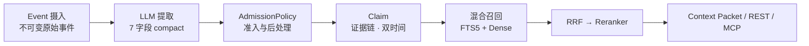

# HL-Mem

[](https://www.python.org/downloads/)
[](LICENSE)
[](docs/CHANGELOG.md)
[](https://github.com/lohr13/hl_mem/actions/workflows/test.yml)

[中文](#中文) | [English](README_EN.md)

<a id="中文"></a>

## 中文

HL-Mem 是面向 AI Agent 的证据驱动长期记忆系统，而不只是一个向量数据库。它把不可变 Event 转化为带证据链的结构化 Claim，以双时间模型记录事实变化，并通过独立的 Experience 通道沉淀 Episode、Trace 与可复用 Policy；SQLite 保存权威数据，高质量 LLM 与 Embedding 服务负责提取和语义召回，sqlite-vec 可选。

**每条记忆都可追溯到不可变的原始事件。**

## 数据如何流动



## 30 秒极速上手

需要 Python 3.12+。前两行在当前终端执行；服务启动后，在另一个终端执行第三行：

```bash
python -m pip install hl-mem
hlmem init
hlmem server
hlmem remember "Alice 喜欢深色模式" && hlmem recall "Alice 喜欢什么"
```

## 五分钟上手

需要 Python 3.12+。先从 PyPI 安装：

```bash
python -m pip install hl-mem
```

在准备存放本地配置和数据库的目录中运行配置向导。向导会要求明确选择 LLM、Embedding 和可选 Reranker，验证服务成功后才原子写入 `hl_mem.toml` 与 `.env`；不会提供低质量 Fake 降级：

```bash
hlmem init
hlmem server
```

另开一个终端，写入并召回记忆：

```bash
hlmem remember "Alice 喜欢深色模式"
hlmem recall "Alice 喜欢什么"
```

召回结果会同时给出 Claim ID、分数和证据引用，例如：

```text
[1] Alice 喜欢深色模式
    ID: <claim-id>
    分数: 0.8123
    证据:
      - event/<event-id>
```

`event/<event-id>` 表示这条 Claim 可追溯到对应的不可变原始事件，而不是一段没有来源的模型文本。可用 `hlmem list` 再次查看 Claim ID，并将它用于 `hlmem forget <claim-id>`、REST 详情查询或 MCP 的 `memory_explain`。

## 进阶安装与集成

### 从源码安装/运行

```bash
git clone https://github.com/lohr13/hl_mem.git
cd hl_mem
uv sync
uv run hlmem init
uv run hlmem server
```

开发环境使用 `uv sync --dev`；安装后可运行 `hlmem doctor` 做只读诊断。SQLite 需要 FTS5，Python 官方发行版通常已包含。

#### editable 源码部署的升级

若生产机使用 `python -m pip install -e .` 安装，`site-packages` 中保存的是指向当前源码目录的链接。此时执行
`python -m pip install -U hl-mem` 不会替换 checkout 中的源码，editable 安装仍会遮蔽后来安装的普通包。升级时必须先
停止 API、Worker 和其他写入者，再通过 Git 更新源码；无外网机器可从审核过的 bundle 快进到目标提交：

```bash
# 联网部署
git pull --ff-only

# 离线部署（二选一）
git fetch /mnt/releases/hl_mem.bundle main
git merge --ff-only FETCH_HEAD
```

源码更新后，用项目虚拟环境的 pip 重新同步依赖和入口点，再重启服务。Linux 发行版的系统 Python 可能受 PEP 668
保护并报 `externally-managed-environment`；不要使用 `sudo pip` 绕过，应创建或复用 venv：

```bash
cd /opt/hl_mem
python3 -m venv .venv                 # 已存在时跳过
env -u PYTHONPATH -u PYTHONHOME .venv/bin/python -m pip install -e .
sudo systemctl restart hl-mem
```

Windows 对应使用 `scripts\hlmem-python.cmd -m pip install -e .`，然后通过实际的服务管理器或计划任务重启服务。

#### 受污染宿主环境

Hermes gateway 等宿主可能向子进程注入指向自身虚拟环境的 `PYTHONPATH` 或 `PYTHONHOME`。此时直接调用本仓库 `.venv` 的 Python，仍可能导入宿主环境中的包，并因 Python 版本不同而加载到不兼容的二进制扩展。从这类宿主运行源码时，请统一通过 launcher 启动：

```bash
bash scripts/hlmem-python.sh -m hl_mem.cli doctor
```

Windows `cmd.exe` 对应使用：

```bat
scripts\hlmem-python.cmd -m hl_mem.cli doctor
```

launcher 会清除两个污染变量、切换到仓库根目录，并固定使用 `.venv/Scripts/python.exe`。`start_hl_mem.sh` 和 `start_production.bat` 也委托给同一入口。

如果 venv 内出现 `No module named pydantic_core._pydantic_core`、`ImportError` 或 Windows 的 `DLL load failed`，先检查
`PYTHONPATH` / `PYTHONHOME`。仅激活 venv 不会清除宿主注入的这两个变量；运行 venv 内的 pip、doctor、server 等工具前，
先移除它们：

```bash
# Windows Git Bash / MSYS
env -u PYTHONPATH -u PYTHONHOME .venv/Scripts/python.exe -m hl_mem.cli doctor

# Linux：当前 shell 后续命令都使用干净环境
unset PYTHONPATH PYTHONHOME
.venv/bin/python -m hl_mem.cli doctor
```

Windows `cmd.exe` 可直接使用上述 `scripts\hlmem-python.cmd`；它等价于先将两个变量置空，再调用仓库 venv。确认干净环境
仍报错时，再在同一 venv 中重新安装依赖，避免把宿主 Python 的二进制扩展复制进来。

### 启用在线模型

从源码仓库将 `config.example.toml` 复制为本地 `hl_mem.toml`，并按需复制 `.env.example`。把启用组件的独立密钥写入 `.env`：`LLM_API_KEY`、`EMBEDDING_API_KEY`、`RERANKER_API_KEY`、`IMAGE_API_KEY`；再将对应的 `extraction.mode`、`embedding.mode`、`reranker.mode`、`image_describer.mode` 切换到在线模式。完整字段见 [配置参考](docs/configuration.md)。

### 连接 Codex、Claude 与 Cursor

运行 `python -m pip install "hl-mem[mcp]"` 安装 MCP extra 后，可使用官方 SDK 2.x 的 stdio 入口 `hl-mem-mcp` 连接 Codex、Claude Code、Claude Desktop 或 Cursor。配置示例和七个工具的契约见 [MCP 使用说明](docs/mcp.md)。

### 集成 Hermes

先启动 HL-Mem 并确认 `curl --fail http://127.0.0.1:8200/healthz` 成功，再安装或升级插件：

```bash
hl-mem hermes install --hermes-home <HERMES_HOME>
hl-mem hermes upgrade --hermes-home <HERMES_HOME>
```

省略 `--hermes-home` 时会从环境变量和常见目录探测 Hermes 根目录。两条命令在目标副本一致时均保持 no-op；`install` 遇到漂移会拒绝覆盖，`upgrade` 会先备份既有插件文件再刷新。`hlmem doctor` 可区分路径正确、路径错误和副本漂移，并分别诊断 daemon、插件与 Context Packet wire 的静态 major 兼容性；它不会执行动态协商或自动升级。插件安装到 `<HERMES_HOME>/plugins/hl_mem/`，并固定读取该目录根下的 `hl_mem.toml` 与 `.env`，不依赖 Hermes 进程 CWD。实际安装或升级后必须重启所有已导入 hl_mem 的 Hermes gateway/CLI 进程；不得用仍持有旧 editable checkout 模块的进程验证新配置。适配器通过本地 HTTP 提供超时、熔断、预取和 Episode/Trace 同步。

### 常驻部署与 systemd

常驻部署使用 `scripts/healthcheck.py` 探测 `/healthz`，将重启和告警交给 systemd、Windows 计划任务或容器编排平台。
systemd 的 `WorkingDirectory` 必须包含 `hl_mem.toml` 和可选 `.env`。

#### Windows：计划任务探活 supervisor（推荐）

仓库内的 `scripts/hlmem_supervisor.py` 是单次执行的静默 supervisor：每次运行复用 healthcheck 探测，健康时清零失败
计数；端口仍被 HL-Mem 占用但 `/healthz` 连续 N 次失败时，校验进程归属后重启服务（N=3，当前默认值）。8200 端口
无人监听时会立即启动，
重启后有 60 秒冷却；状态和日志分别写入 `var/supervisor.state`、`var/supervisor.log`。以下示例假定仓库位于
`D:\workspace\hl_agent\hl_mem`，路径中不含空格。

1. 在管理员 `cmd.exe` 中准备 venv、配置并手动跑一次 supervisor。首次运行会启动服务；随后确认 healthcheck 成功：

   ```bat
   cd /d D:\workspace\hl_agent\hl_mem
   py -3.13 -m venv .venv
   scripts\hlmem-python.cmd -m pip install -e .
   if not exist hl_mem.toml copy config.example.toml hl_mem.toml
   scripts\hlmem-python.cmd scripts\hlmem_supervisor.py
   scripts\hlmem-python.cmd scripts\healthcheck.py
   ```

   已有 `.venv` 或生产配置时跳过对应创建步骤，不要覆盖现有 `hl_mem.toml` / `.env`。

2. 创建每 2 分钟运行一次的计划任务。任务使用 `pythonw.exe`，探活和重启均不弹控制台窗口；`SYSTEM` 账户还需对仓库、
   `var/`、配置和 `.env` 有访问权限：

   ```bat
   schtasks /Create /TN "HL-Mem Supervisor" /SC MINUTE /MO 2 /ST 00:00 /RU SYSTEM /RL HIGHEST /TR "D:\workspace\hl_agent\hl_mem\.venv\Scripts\pythonw.exe D:\workspace\hl_agent\hl_mem\scripts\hlmem_supervisor.py" /F
   schtasks /Run /TN "HL-Mem Supervisor"
   ```

3. 验证任务、健康状态和日志：

   ```bat
   schtasks /Query /TN "HL-Mem Supervisor" /V /FO LIST
   D:\workspace\hl_agent\hl_mem\.venv\Scripts\python.exe D:\workspace\hl_agent\hl_mem\scripts\healthcheck.py
   powershell -NoProfile -Command "Get-Content 'D:\workspace\hl_agent\hl_mem\var\supervisor.log' -Tail 50"
   ```

   计划任务的“上次运行结果”可能因一次探活失败显示非零，故障原因与是否已重启以 `supervisor.log` 为准。取消部署时运行
   `schtasks /Delete /TN "HL-Mem Supervisor" /F`；删除任务不会删除数据库、日志或已经运行的服务进程。

悬空冲突可先只读巡检，再显式应用安全修复；默认命令不修改数据库，`--apply` 只删除终态且双侧 Claim 均已缺失的 case：

```bash
hl-mem conflicts repair-dangling
hl-mem conflicts repair-dangling --apply
```

pending `dedup_pairs` 中低于当前 `dedup.threshold` 的项目可先在离线副本只读预览；应用时必须给出预览得到的
精确数量，工具只写终态判定和审计，不修改 Claim：

```bash
hl-mem --db copy.db dedup drain-below-floor
hl-mem --db copy.db dedup drain-below-floor --apply --expected-count 597
```

expired 历史先保留 90 天；仅无下游 evidence 消费者且无 open conflict 的项目可在副本预览并按精确计数有界回收：

```bash
hl-mem --db copy.db expired cleanup
hl-mem --db copy.db expired cleanup --apply --expected-count 4508 --limit 100
```

固定 200-point 注入治理 fixture 可离线构造并回放 echo × freshness 2×2；报告只执行结构门禁，线上
observe/canary 质量裁决仍由部署后的 Hermes 评估负责：

```bash
python scripts/run_v0291_injection_replay.py --output var/eval/v0291-injection-replay.json
python scripts/run_v0291_injection_replay.py --output var/eval/v0291-injection-replay.json \
  --export-expanded-fixture var/eval/v0291-injection-fixture.jsonl
```

REST 的完整请求契约见 [API 文档](docs/api.md)。

## 关键配置

通用 CLI/server 从当前工作目录读取 `hl_mem.toml`，Hermes 插件固定从 `<HERMES_HOME>` 读取；密钥只从对应
`.env` 或同名进程环境变量读取。相对 `database.path` 以配置文件 symlink 的真实目标目录为基准，异平台绝对路径
会在启动前失败。常用键如下，完整列表见 [配置参考](docs/configuration.md)。

| TOML 键 | 代码默认值 | 说明 |
|---|---:|---|
| `database.path` | `var/hl_mem.db` | SQLite 数据库路径；相对配置文件真实目录解析 |
| `extraction.mode` | `llm` | 生产提取器：`real` 或 `llm`；Fake 仅供测试 |
| `extraction.batch_max_events` | `5` | 同 session 单次提取的 Event 上限 |
| `extraction.batch_max_wait_seconds` | `120.0` | 未满窗口的最长等待时间 |
| `embedding.mode` | `real` | 生产向量化固定为 `real`；Fake 仅供测试 |
| `embedding.text_type` | 未设置 | native 模式可选 `document` 或 `query`；默认不发送 |
| `reranker.mode` | `off` | 重排：`off`、`on` 或 `real`；Fake 仅供测试 |
| `image_describer.mode` | `off` | 图片描述：`off` 或 `on` |
| `llm.provider` | `dashscope` | `dashscope`、`zhipu` 或 `openai_compatible` |
| `llm.structured_mode` | `json_object` | `auto`、`json_object` 或 `json_schema` |
| `index.text_mode` | `natural` | `legacy`、`value_only`、`natural` 或 `answerable`；natural 只拼 subject 与原语言 value |
| `recall.vector_backend` | `sqlite_scan` | `sqlite_scan`（默认）或需安装 `hl-mem[sqlite-vec]` 的 `sqlite_vec` |
| `recall.dedup_threshold` | `0.95` | 候选窗内近重复折叠阈值；设为 `0` 关闭折叠 |
| `recall.dedup_candidate_limit` | `100` | 每次召回参与近重复折叠判定的候选上限 |
| `recall.echo_suppression_mode` | `enforce` | 同会话回声治理：`off`、只观测的 `observe` 或 `enforce` |
| `recall.freshness_annotation_mode` | `render` | 风险门控的新鲜度提示：`off`、只观测的 `observe` 或 `render` |
| `recall.resurrection_mode` | `off` | 显式设为 `auto` 才启用有界 archived-only 冷路径 |
| `recall.query_expansion_mode` | `off` | 多查询召回：`off`、`auto` 或 `always` |
| `decay.model` | `activation_halflife` | 按 scope 半衰期衰减 activation，不因日常衰减改写 confidence |
| `dedup.enabled` | `true` | 开启确定性 near-copy 审查；不调用 LLM，不合并 Claim |
| `dedup.llm_enabled` | `false` | 显式开启 LLM dedup；仍受统一预算和审计约束 |
| `dedup.scan_limit` | `200` | 每轮维护最多审查的 pending `dedup_pairs` 数量 |
| `worker.semantic_conflict_consolidation_enabled` | `false` | 显式开启只写审计结果的 LLM 冲突分类 |
| `worker.policy_induction_enabled` | `false` | 显式开启从 Episode 自动发布派生 Policy |
| `worker.reclassify_enabled` | `false` | 显式开启 LLM Claim 重分类 |
| `relation.discovery_mode` | `off` | 关系发现：`off` 或只生成提案的 `audit` |

LLM、Embedding 与 Reranker 可通过受治理的 [Provider Plugin API](docs/provider-plugins.md) 扩展；图片 Provider
使用同一机制但仍为 Experimental。插件必须显式加入 `plugins.enabled`，在宿主进程内运行且不具备沙箱隔离。

真实组件和外部调用路径必须提供各自密钥；失败时不会自动切换为 fake。任意 `HL_MEM_*` 环境变量都不再参与应用 `Settings` 配置。
`Settings` 与 `config.example.toml` 的 `recall.default_limit` / `recall.relevance_reranker_floor` 均为 `5` / `0.15`；
示例部署仅把 `recall.relevance_relative_drop` 从代码默认 `0.15` 显式调整为 `0.30`，并保持
`recall.relevance_keep_top1 = true`。query expansion 使用独立可配置模型，并且默认关闭。

### 向量检索规模指引

默认 `sqlite_scan` 是两阶段精确扫描，适合约 10 万条 Claim 以内的本地库；实际边界还取决于 embedding
维度、并发和延迟目标。接近或超过该规模时，应安装 `hl-mem[sqlite-vec]` 并显式设置
`recall.vector_backend = "sqlite_vec"`，避免把全量向量扫描当作无界生产索引。SQLite 主表仍是权威数据源，
`sqlite_vec` 只维护可重建的派生投影。

从 legacy 索引迁移既有数据库时，先只读预览，再显式执行回填；回填会同步 `index_text`、FTS 和 dense embedding，使用 real embedder 的部署需提供对应密钥：

```bash
hlmem backfill-index-text --mode natural --dry-run
hlmem backfill-index-text --mode natural
```

### 升级到 v0.36.0

升级会应用仅向前的 migration 057：把遗留的非终态 `resolve_conflict_llm` job 标为 `dead`、清除租约，并把
关联开放案重新标为 dirty，使其回到确定性 L0 或 `manual_required` 路径；既有 `succeeded`/`dead` 历史保持不变。
内置冲突判官及其配置面已退役，`conflict.auto_mode` 仅接受 `l0_only` 与 `off`；旧值会在启动时 fail-closed。
升级启动前必须从 `hl_mem.toml` 删除整个 `[maintenance_judge]` 段，并把旧 `observe`/`enforce` 值改为
`l0_only` 或 `off`。冲突终态 rationale 改为不可改写；delegation 写端点现同时支持 pair 四词表和既有 group
词表，并建议宿主始终携带同一 dossier 的 revision 与 v2 fingerprint。

### 升级到 v0.33.0

v0.33.0 默认启用新的 coverage-first 提取 prompt，并把单 chunk Claim 上限提高到 30；触顶软拆分和残余修复仍
默认关闭。`extraction.delta_repair_enabled` 只有同时启用 `extraction.soft_split_enabled`，且首次二分后的子块仍
命中 30 条上限时才会懒触发；单独启用不会增加提取调用。保持 provider 旧行为时不设置 `llm.max_tokens` 和
`llm.reasoning_effort`，并保留 `llm.thinking_control = "auto"`。

升级会按顺序应用 migration 055–056，为 Claim 的 UPDATE/DELETE 增加数据库边界审计及可移植的审计上下文。
升级前停止 API、Worker 和其他写入者，并把主库、WAL 已 checkpoint 的副本与 tombstone sidecar 作为一组备份。
两项 migration 均只向前执行；旧二进制不了解新审计语义，升级后不得回滚旧二进制继续写库。

### 升级到 v0.31.1

v0.31.1 修复 Hermes 插件配置定位和数据库影子路径风险。升级前先在 fresh process 中确认新版本解析出的数据库
绝对路径；若与旧进程实际打开的文件不同，先做受控迁移，不要让新版本自动创建空库。推荐保持
`database.path = "var/hl_mem.db"`，不要在 Linux 使用 Windows drive/UNC 路径，也不要在 Windows 使用 POSIX
根路径。插件升级后必须重启所有已导入 hl_mem 的 Hermes gateway/CLI 进程；磁盘 checkout、metadata、已部署
插件副本和进程内模块必须一致。本版没有新增 TOML key 或 migration。

### 升级到 v0.31.0

v0.31.0 新增 typed canonical entity、价格 canonical target、plan fulfillment、治理动作账本以及带 slot 的
跨 subject dedup 审计。发布默认只开启已通过冻结门禁的破坏性行为：plan fulfillment 与价格 target 为
`enforce`，冲突自动化为 `l0_only`；dedup 继续 `audit_only=true`，查询实体约束和 lesson signal 继续
`observe`。Hermes 默认只在 session 首次或残留人工冲突计数变化时提示一次。

生产运行不依赖内置冲突判官。`l0_only` 只执行确定性 L0，灰区案进入 `manual_required`。所有自动修改均记录
输入指纹和治理动作，紧急回退可分别设置：

```toml
[conflict]
auto_mode = "off"

[plan]
fulfillment_mode = "observe"

[price]
target_mode = "observe"

[hermes]
manual_conflict_notice = false
```

升级会按顺序应用 migration 050–054。升级前停止 API、Worker 和其他写入者，并把主库、WAL 已 checkpoint 的
副本与 tombstone sidecar 作为一组备份。新表和 nullable 列为 additive，但旧二进制不了解新治理语义，升级后不得
回滚旧二进制继续写库。

### 升级到 v0.29.3

v0.29.3 不需要 schema migration，也没有配置或 REST/MCP API 破坏。升级后，价格/计量类 temporal 判定会按
三分支处理：同一序列的不同时间快照自动推进并让旧值退出 current-state 召回；不同度量或不同标的直接共存；
同坐标修订、隐式替换及无法证明的灰区继续进入人工冲突管线。Recall/ingest 编排器拆分和复杂度预算门禁不改变
运行时行为，`daemon_contract` 仍为 `1`。

temporal 三分支没有回退开关；这项行为变化就是本版升级目的。必须恢复旧判定时只能降级版本。

### 升级到 v0.29.2

升级后同会话 echo 抑制和风险门控 freshness 提示即按默认值启用，不需要 migration 脚本。若要退回旧行为，
在 `hl_mem.toml` 显式配置：

```toml
recall.echo_suppression_mode = "off"
recall.freshness_annotation_mode = "off"
```

### 从 v0.27.x 升级

v0.28.6 新增可选的 `hermes.on_demand_recall_timeout_seconds`（默认 `8.0`），不改变 v0.27 的
`recall.resurrection_mode = "auto"` 与 `decay.model = "activation_halflife"` 默认值。若从 v0.26
跨版本升级并希望保持旧行为，仍可显式配置：

```toml
[recall]
resurrection_mode = "off"

[decay]
model = "legacy_linear"
```

升级前停止 API、Worker 和其他写入者，并保留主库的离线副本。首次由 v0.28 打开数据库时会自动执行
migration 043/044；随后应立即运行一次 `hlmem backup`，它会创建并绑定 `<database>.tombstones.db`，生成
manifest v2。主库 backup、manifest 与 tombstone ledger 必须作为一组保护；旧 manifest v1 无法证明删除历史，
v0.28 restore 会明确拒绝。migration 不裁决存量冲突，也不自动删除历史异常，仍须通过显式 audit/repair 流程处理。

## 能力概览

| 核心记忆 | 服务与治理 |
|---|---|
| **记忆正确性**<br>幂等摄入、原子写入与精确去重<br>冲突收敛 + 三入口删除闭环与 tombstone 防复活 | **经验通道**<br>Episode、Trace 与 Reward<br>Policy/Procedure 与派生 Observation |
| **时间与证据**<br>Claim 与关系边双时间模型<br>证据链、实体归一化、受控归档与物理遗忘 | **接口**<br>稳定的 FastAPI REST 与 Hermes Provider<br>Beta 阶段的七工具 MCP stdio 接口 |
| **混合召回**<br>中文 FTS5 + Dense，经 RRF 融合与可选 Reranker<br>关系/查询扩展与 Token 预算上下文 | **评测**<br>提取评测 v2、112-case 隔离检索与 40-case 中文 E2E<br>LongMemEval、MemDaily、PerLTQA 完整 runner |
| **生命周期**<br>importance 联动 TTL、activation 衰减与归档清理<br>manifest v2 备份 + tombstone restore replay | **治理工具**<br>7 字段 compact 提取 + 显式 evidence 的 canonical slot<br>Job 写入进度、dangling 巡检与 active Claim 修复 |

### 评测结果（公开冻结口径）

| 评测 | 口径 | 结果 |
|---|---|---:|
| LongMemEval · HL-Mem v0.25.2 | holdout50，Top-10 结构化 evidence | **43/50（86.0%）** |
| LongMemEval · Full-Context 上限 | 全部 session 直接送入 reader | **46/50（92.0%）** |
| LongMemEval · Native RAG 基线 | raw-session dense RAG，Top-10 | **45/50（90.0%）** |
| MemDaily · v0.26.0（2026-08-15） | 180 trajectories，提取 → 召回 → QA | **accuracy 97.2%，F1 0.9855，R@5 97.5%** |
| PerLTQA · v0.26.0（2026-08-15） | 378 questions，10 characters，纯检索 | **R@5 96.8%，MRR 82.8%** |
| 中文 E2E · v0.26.0（2026-08-15） | 40 cases，`deterministic-rubric-v2` live | **38/40（95.0%）**；R@5 **100%** |
| v0.27.1 行为变更验证（2026-08-15） | 沿用 v0.26.0 数字口径；本版未重跑全量 benchmark | **resurrection：2 次正确复活、0 次误伤，p95 12.7ms；activation：identity 零误杀，confidence 语义分离** |
| v0.28.0 维护与实验验证（2026-08-16） | 沿用上述公开 benchmark；本版未重跑全量 benchmark | **slot 误配修复 16/16、0 回退；关系语义 packet RAO 12%、entity@5 无增益，未产品化** |

中文基准的 embedding/reranker 均为 `qwen3.7-text-embedding` / `qwen3-rerank`。PerLTQA 直灌语料、不经提取；MemDaily 与中文 E2E 按提取 → 召回 → QA 全链路运行，提取和 QA 均使用 `qwen3.7-plus`。MemDaily 以 180 条轨迹全量计分。

LongMemEval 三角对照统一使用 `deepseek-v4-flash-0731` reader，reader 开启 thinking、judge 关闭
thinking；benchmark reader 与生产 recall/context packing 是不同契约。中文隔离检索和 E2E 的当前运行与
回归口径见[评测说明](tests/eval/README.md)，本地产物命名见[结果索引](evaluation/results/README.md)。

### 已知边界

- 当前模型在 v0.28 source-first 冻结 A/B 中只让 12% 的关系题 packet 获得完整 RAO，entity coverage@5
  保持 34.7%，且没有形成可供关系扩展使用的边；因此该关系语义注解方案及 C 系列实验臂均未产品化。
  生产仍只使用既有 compact Claim、来源受控的 RAO 渲染和普通 relation expansion，不能假设系统会从平铺文本
  自动恢复高密度、方向完备的关系链。

能力成熟度、默认开关和证据见 [能力矩阵](docs/capability-matrix.md)，架构与数据流见 [架构文档](docs/architecture.md)。

## 项目状态

- **Stable**：事件与证据链、原子写入、LLM 提取、Embedding、FTS + Dense + RRF、双时间过滤、TTL/衰减/归档、冲突与去重、REST、Hermes、备份与审计。
- **Beta**：多查询召回、关系候选发现、反馈驱动维护、提取蕴含审计、语义去重审计、MCP Server、Benchmark 与 LongMemEval。
- **Experimental**：图片证据、提取预过滤、独立 Tag 通道、PostgreSQL 连通性探针。

当前基线为 v0.36.1，共 59 个不可变、仅向前执行的 SQL Migration。migration 055–057 增加 Claim mutation 审计并
退役遗留冲突判官；migration 058 终止升级前遗留的 pending 语义任务，migration 059 为关系边增加来源闭环。升级前仍须
停止写入者并备份主库与 tombstone sidecar，旧二进制不得再打开已升级数据库。

## 文档

| 文档 | 内容 |
|---|---|
| [文档索引](docs/README.md) | 所有维护中文档的导航 |
| [配置参考](docs/configuration.md) | TOML 键、默认值、允许值与密钥边界 |
| [架构](docs/architecture.md) | 分层、模块、写入/召回管线、存储和生命周期 |
| [API](docs/api.md) | REST 端点和请求约定 |
| [Delegation 宿主集成](docs/delegation.md) | pair/group 冲突轮询、裁决原则与 Linux 宿主示例 |
| [MCP](docs/mcp.md) | stdio 启动参数、Codex/Claude/Cursor 配置与工具错误语义 |
| [兼容性策略](docs/compatibility.md) | 版本和公共契约保证 |
| [能力矩阵](docs/capability-matrix.md) | 成熟度、默认值和验证证据 |
| [变更日志](docs/CHANGELOG.md) | 发布历史 |

## Contributing / 贡献指南

欢迎通过 Issue 和 Pull Request 参与。开发环境、七项 CI 预检、数据边界及提交约定见
[CONTRIBUTING.md](CONTRIBUTING.md)。

## License / 许可证

本项目采用 [Apache License 2.0](LICENSE)。你可以在许可证条款允许的范围内使用、修改和分发本项目，并须保留所要求的版权及许可证声明。

**English:** Licensed under the [Apache License 2.0](LICENSE). You may use, modify, and distribute this project subject to its terms, including the required notices.
