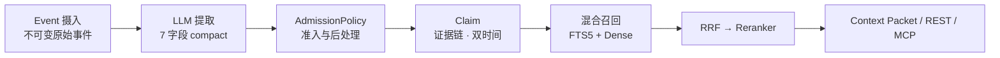

# HL-Mem

[](https://www.python.org/downloads/)
[](LICENSE)
[](docs/CHANGELOG.md)
[](https://github.com/lohr13/hl_mem/actions/workflows/test.yml)

[中文](#中文) | [English](README_EN.md)

<a id="中文"></a>

## 中文

HL-Mem 是面向 AI Agent 的本地优先、证据驱动长期记忆系统，而不只是一个向量数据库。它把不可变 Event 转化为带证据链的结构化 Claim，以双时间模型记录事实变化，并通过独立的 Experience 通道沉淀 Episode、Trace 与可复用 Policy；默认只需 SQLite，也可按需启用在线模型与 sqlite-vec。

**每条记忆都可追溯到不可变的原始事件。**

## 数据如何流动



## 30 秒极速上手

需要 Python 3.11+。前两行在当前终端执行；服务启动后，在另一个终端执行第三行：

```bash
python -m pip install hl-mem
hlmem init --offline && hlmem server
hlmem remember "Alice 喜欢深色模式" && hlmem recall "Alice 喜欢什么"
```

## 五分钟上手

需要 Python 3.11+。先从 PyPI 安装：

```bash
python -m pip install hl-mem
```

在准备存放本地配置和数据库的目录中，生成无需 API key 的离线配置并启动服务：

```bash
hlmem init --offline
hlmem server
```

另开一个终端，写入并召回记忆：

```bash
hlmem remember "Alice 喜欢深色模式"
hlmem recall "Alice 喜欢什么"
```

召回结果会同时给出 Claim ID、分数和证据引用，例如：

```text
[1] Alice 喜欢深色模式
    ID: <claim-id>
    分数: 0.8123
    证据:
      - event/<event-id>
```

`event/<event-id>` 表示这条 Claim 可追溯到对应的不可变原始事件，而不是一段没有来源的模型文本。可用 `hlmem list` 再次查看 Claim ID，并将它用于 `hlmem forget <claim-id>`、REST 详情查询或 MCP 的 `memory_explain`。离线配置是 FTS-only 关键词召回；fake embedding 只保持存储结构兼容，不提供语义检索。

## 进阶安装与集成

### 从源码安装/运行

```bash
git clone https://github.com/lohr13/hl_mem.git
cd hl_mem
uv sync
uv run hlmem init --offline
uv run hlmem server
```

开发环境使用 `uv sync --dev`；安装后可运行 `hlmem doctor` 做只读诊断。SQLite 需要 FTS5，Python 官方发行版通常已包含。

#### 受污染宿主环境

Hermes gateway 等宿主可能向子进程注入指向自身虚拟环境的 `PYTHONPATH` 或 `PYTHONHOME`。此时直接调用本仓库 `.venv` 的 Python，仍可能导入宿主环境中的包，并因 Python 版本不同而加载到不兼容的二进制扩展。从这类宿主运行源码时，请统一通过 launcher 启动：

```bash
bash scripts/hlmem-python.sh -m hl_mem.cli doctor
```

Windows `cmd.exe` 对应使用：

```bat
scripts\hlmem-python.cmd -m hl_mem.cli doctor
```

launcher 会清除两个污染变量、切换到仓库根目录，并固定使用 `.venv/Scripts/python.exe`。`start_hl_mem.sh` 和 `start_production.bat` 也委托给同一入口。

### 启用在线模型

从源码仓库将 `config.example.toml` 复制为本地 `hl_mem.toml`，并按需复制 `.env.example`。把启用组件的独立密钥写入 `.env`：`LLM_API_KEY`、`EMBEDDING_API_KEY`、`RERANKER_API_KEY`、`IMAGE_API_KEY`；再将对应的 `extraction.mode`、`embedding.mode`、`reranker.mode`、`image_describer.mode` 切换到在线模式。完整字段见 [配置参考](docs/configuration.md)。

### 连接 Codex、Claude 与 Cursor

运行 `python -m pip install "hl-mem[mcp]"` 安装 MCP extra 后，可使用官方 SDK 2.x 的 stdio 入口 `hl-mem-mcp` 连接 Codex、Claude Code、Claude Desktop 或 Cursor。配置示例和七个工具的契约见 [MCP 使用说明](docs/mcp.md)。

### 集成 Hermes

先启动 HL-Mem 并确认 `curl --fail http://127.0.0.1:8200/healthz` 成功，再从源码仓库运行：

```bash
uv run python scripts/install_to_hermes.py --hermes-home <HERMES_HOME>
```

插件安装到 `<HERMES_HOME>/plugins/hl_mem/`；完成后必须重启 Hermes。适配器通过本地 HTTP 提供超时、熔断、预取和 Episode/Trace 同步。

### 常驻部署与 systemd

常驻部署使用 `scripts/healthcheck.py` 探测 `/healthz`，将重启和告警交给 systemd、Windows 服务管理器或容器编排平台。systemd 的 `WorkingDirectory` 必须包含 `hl_mem.toml` 和可选 `.env`。

REST 的完整请求契约见 [API 文档](docs/api.md)。

## 关键配置

非敏感配置只从当前工作目录的 `hl_mem.toml` 读取；密钥只从 `.env` 或同名进程环境变量读取。常用键如下，完整列表见
[配置参考](docs/configuration.md)。

| TOML 键 | 代码默认值 | 说明 |
|---|---:|---|
| `database.path` | `var/hl_mem.db` | SQLite 数据库路径 |
| `extraction.mode` | `fake` | 提取器：`fake`、`real` 或 `llm` |
| `extraction.batch_max_events` | `5` | 同 session 单次提取的 Event 上限 |
| `extraction.batch_max_wait_seconds` | `120.0` | 未满窗口的最长等待时间 |
| `embedding.mode` | `fake` | 向量化：`fake` 或 `real` |
| `embedding.text_type` | 未设置 | native 模式可选 `document` 或 `query`；默认不发送 |
| `reranker.mode` | `off` | 重排：`off`、`fake`、`on` 或 `real` |
| `image_describer.mode` | `off` | 图片描述：`off` 或 `on` |
| `llm.provider` | `dashscope` | `dashscope`、`zhipu` 或 `openai_compatible` |
| `llm.structured_mode` | `json_object` | `auto`、`json_object` 或 `json_schema` |
| `index.text_mode` | `natural` | `legacy`、`value_only`、`natural` 或 `answerable`；natural 只拼 subject 与原语言 value |
| `recall.vector_backend` | `sqlite_scan` | `sqlite_scan`（默认）或需安装 `hl-mem[sqlite-vec]` 的 `sqlite_vec` |
| `recall.dedup_threshold` | `0.95` | 候选窗内近重复折叠阈值；设为 `0` 关闭折叠 |
| `recall.dedup_candidate_limit` | `100` | 每次召回参与近重复折叠判定的候选上限 |
| `recall.resurrection_mode` | `auto` | 主召回证据不足时启用有界 archived-only 冷路径；设为 `off` 可关闭 |
| `recall.query_expansion_mode` | `auto` | 多查询召回：`off`、`auto` 或 `always` |
| `decay.model` | `activation_halflife` | 按 scope 半衰期衰减 activation，不因日常衰减改写 confidence |
| `dedup.scan_limit` | `200` | 每轮维护最多审查的 pending `dedup_pairs` 数量 |
| `relation.discovery_mode` | `off` | 关系发现：`off`、`audit` 或 `auto` |
| `recall.tag_channel_enabled` | `false` | 是否启用独立 Tag 检索通道 |

真实组件和外部调用路径必须提供各自密钥；失败时不会自动切换为 fake。任意 `HL_MEM_*` 环境变量都不再参与应用 `Settings` 配置。
`Settings` 与 `config.example.toml` 的 `recall.default_limit` / `recall.relevance_reranker_floor` 均为 `5` / `0.15`；
示例部署仅把 `recall.relevance_relative_drop` 从代码默认 `0.15` 显式调整为 `0.30`，并保持
`recall.relevance_keep_top1 = true`。query expansion 使用独立可配置模型，单次/总超时为 5/6 秒。

从 legacy 索引迁移既有数据库时，先只读预览，再显式执行回填；回填会同步 `index_text`、FTS 和 dense embedding，使用 real embedder 的部署需提供对应密钥：

```bash
hlmem backfill-index-text --mode natural --dry-run
hlmem backfill-index-text --mode natural
```

### 从 v0.26.0 升级

v0.27.0 默认启用受控归档复活，并把日常衰减切换为 activation 半衰期模型。旧配置不声明这两个键时会采用新默认；
如需保持 v0.26 行为，请显式配置：

```toml
[recall]
resurrection_mode = "off"

[decay]
model = "legacy_linear"
```

升级前请备份并停止 API、Worker 和其他写入者；migration 041/042 只向前执行，分别增加互斥组激活保护和
activation 生命周期字段。已有冲突脏数据不会被 migration 自动裁决，仍须通过显式 audit/repair 流程处理。

## 能力概览

| 核心记忆 | 服务与治理 |
|---|---|
| **记忆正确性**<br>幂等摄入、原子写入与精确去重<br>保守近重复治理与受守卫的冲突收敛 | **经验通道**<br>Episode、Trace 与 Reward<br>Policy/Procedure 与派生 Observation |
| **时间与证据**<br>有效时间 + 记录时间双时间模型<br>证据链、实体归一化、显式遗忘与 stale 传播 | **接口**<br>稳定的 FastAPI REST 与 Hermes Provider<br>Beta 阶段的七工具 MCP stdio 接口 |
| **混合召回**<br>中文 FTS5 + Dense，经 RRF 融合与可选 Reranker<br>关系/查询扩展与 Token 预算上下文 | **评测**<br>提取评测 v2、112-case 隔离检索与 40-case 中文 E2E<br>LongMemEval、MemDaily、PerLTQA 完整 runner |
| **生命周期**<br>importance 联动 TTL、衰减、归档与重分类<br>反馈效用、审计日志与在线备份 | **治理工具**<br>7 字段 compact 提取 + 统一 AdmissionPolicy<br>有界修复、近重复审查与 active Claim 审计/修复 |

### 评测结果（公开冻结口径）

| 评测 | 口径 | 结果 |
|---|---|---:|
| LongMemEval · HL-Mem v0.25.2 | holdout50，Top-10 结构化 evidence | **43/50（86.0%）** |
| LongMemEval · Full-Context 上限 | 全部 session 直接送入 reader | **46/50（92.0%）** |
| LongMemEval · Native RAG 基线 | raw-session dense RAG，Top-10 | **45/50（90.0%）** |
| MemDaily · v0.26.0（2026-08-15） | 180 trajectories，提取 → 召回 → QA | **accuracy 97.2%，F1 0.9855，R@5 97.5%** |
| PerLTQA · v0.26.0（2026-08-15） | 378 questions，10 characters，纯检索 | **R@5 96.8%，MRR 82.8%** |
| 中文 E2E · v0.26.0（2026-08-15） | 40 cases，`deterministic-rubric-v2` live | **38/40（95.0%）**；R@5 **100%** |

中文基准的 embedding/reranker 均为 `qwen3.7-text-embedding` / `qwen3-rerank`。PerLTQA 直灌语料、不经提取；MemDaily 与中文 E2E 按提取 → 召回 → QA 全链路运行，提取和 QA 均使用 `qwen3.7-plus`。MemDaily 以 180 条轨迹全量计分。

LongMemEval 三角对照统一使用 `deepseek-v4-flash-0731` reader，reader 开启 thinking、judge 关闭
thinking；benchmark reader 与生产 recall/context packing 是不同契约。中文隔离检索和 E2E 的当前运行与
回归口径见[评测说明](tests/eval/README.md)，本地产物命名见[结果索引](evaluation/results/README.md)。

能力成熟度、默认开关和证据见 [能力矩阵](docs/capability-matrix.md)，架构与数据流见 [架构文档](docs/architecture.md)。

## 项目状态

- **Stable**：事件与证据链、原子写入、LLM 提取、Embedding、FTS + Dense + RRF、双时间过滤、TTL/衰减/归档、冲突与去重、REST、Hermes、备份与审计。
- **Beta**：多查询召回、关系候选发现、反馈驱动维护、提取蕴含审计、语义去重审计、MCP Server、Benchmark 与 LongMemEval。
- **Experimental**：图片证据、提取预过滤、独立 Tag 通道、PostgreSQL 连通性探针。

当前基线为 v0.27.1，共 42 个不可变、仅向前执行的 SQL Migration。

## 文档

| 文档 | 内容 |
|---|---|
| [文档索引](docs/README.md) | 所有维护中文档的导航 |
| [配置参考](docs/configuration.md) | TOML 键、默认值、允许值与密钥边界 |
| [架构](docs/architecture.md) | 分层、模块、写入/召回管线、存储和生命周期 |
| [API](docs/api.md) | REST 端点和请求约定 |
| [MCP](docs/mcp.md) | stdio 启动参数、Codex/Claude/Cursor 配置与工具错误语义 |
| [兼容性策略](docs/compatibility.md) | 版本和公共契约保证 |
| [能力矩阵](docs/capability-matrix.md) | 成熟度、默认值和验证证据 |
| [变更日志](docs/CHANGELOG.md) | 发布历史 |

## Contributing / 贡献指南

欢迎通过 Issue 和 Pull Request 参与。开发环境、七项 CI 预检、数据边界及提交约定见
[CONTRIBUTING.md](CONTRIBUTING.md)。

## License / 许可证

本项目采用 [Apache License 2.0](LICENSE)。你可以在许可证条款允许的范围内使用、修改和分发本项目，并须保留所要求的版权及许可证声明。

**English:** Licensed under the [Apache License 2.0](LICENSE). You may use, modify, and distribute this project subject to its terms, including the required notices.
