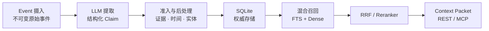

# HL-Mem

[](https://www.python.org/downloads/)
[](LICENSE)
[](docs/CHANGELOG.md)
[](https://github.com/lohr13/hl_mem/actions/workflows/test.yml)

[中文](#中文) | [English](README_EN.md)

<a id="中文"></a>

## 中文

HL-Mem 是面向 AI Agent 的证据驱动长期记忆系统。它把不可变 Event 转换为带来源的结构化 Claim，使用双时间
模型记录事实变化，并通过独立的 Experience 通道保存 Episode、Trace 与可复用 Policy。SQLite 是权威数据源，
LLM 负责提取，FTS 与向量检索负责召回。

**每条记忆都可追溯到原始事件，而不是一段没有来源的模型文本。**

## 数据流



## 快速开始

需要 Python 3.12+；项目当前只在 Python 3.13 上运行权威 CI，具体口径见[支持策略](docs/support.md)。

```bash
python -m pip install hl-mem
hlmem init
hlmem server
```

`hlmem init` 会要求选择并验证 LLM、Embedding 和可选 Reranker，然后写入当前目录下的 `hl_mem.toml` 与
`.env`。服务启动后，在另一个终端写入和召回记忆：

```bash
hlmem remember "Alice 喜欢深色模式"
hlmem recall "Alice 喜欢什么"
```

召回结果包含 Claim ID、相关性分数和 `event/<event-id>` 证据引用。常用管理命令：

```bash
hlmem list
hlmem explain claim <claim-id>
hlmem forget <claim-id>
hlmem doctor
```

## 核心能力

| 领域 | 能力 |
|---|---|
| 写入 | 幂等 Event 摄入、结构化提取、准入检查、原子持久化 |
| 证据与时间 | Event 证据链、双时间模型、TTL、衰减、归档与遗忘 |
| 召回 | 中文 FTS、Dense、RRF、可选 Reranker 与有界上下文 |
| 治理 | 冲突收敛、近重复审查、审计账本和可解释 Claim |
| 经验 | Episode、Trace、Reward、Policy 与 Procedure |
| 接口 | CLI、FastAPI REST、MCP stdio 与 Hermes 适配器 |

稳定性、默认开关和验证证据以[能力矩阵](docs/capability-matrix.md)为准。

## 安装与集成

### 从源码运行

```bash
git clone https://github.com/lohr13/hl_mem.git
cd hl_mem
uv sync
uv run hlmem init
uv run hlmem server
```

开发与测试使用 `uv` 和仓库锁文件。部署、备份、恢复和运行边界见[架构文档](docs/architecture.md)与
[兼容性策略](docs/compatibility.md)。

### 在线模型

非敏感配置写入 `hl_mem.toml`；各组件密钥写入 `.env` 或同名进程环境变量。HL-Mem 不会在真实组件失败时
自动切换到 Fake Provider。Provider、模型和全部字段见[配置参考](docs/configuration.md)。

### MCP

```bash
python -m pip install "hl-mem[mcp]"
hl-mem-mcp
```

Codex、Claude Code、Claude Desktop 和 Cursor 的连接示例见 [MCP 使用说明](docs/mcp.md)。

### Hermes

HL-Mem 服务健康后，可安装或升级 Hermes 插件：

```bash
hl-mem hermes install --hermes-home <HERMES_HOME>
hl-mem hermes upgrade --hermes-home <HERMES_HOME>
```

插件固定从 Hermes 根目录读取配置；安装或升级后需重启已加载插件的 Hermes 进程。集成边界见
[架构文档](docs/architecture.md)。

### 可选 sqlite-vec

默认 `sqlite_scan` 适合本地中小规模数据。需要 sqlite-vec 派生索引时安装：

```bash
python -m pip install "hl-mem[sqlite-vec]"
```

随后将 `recall.vector_backend` 设为 `sqlite_vec`。SQLite 主表始终是权威数据源。

## 常用配置

| TOML 键 | 默认值 | 用途 |
|---|---:|---|
| `database.path` | `var/hl_mem.db` | SQLite 数据库路径 |
| `llm.provider` | `dashscope` | 提取模型 Provider |
| `extraction.batch_max_events` | `5` | 单次提取窗口 Event 上限 |
| `extraction.batch_max_wait_seconds` | `120.0` | 未满窗口的最长等待时间 |
| `embedding.mode` | `real` | 生产向量化模式 |
| `reranker.mode` | `off` | 是否启用重排 |
| `recall.vector_backend` | `sqlite_scan` | 向量检索后端 |
| `recall.query_expansion_mode` | `off` | 查询扩展策略 |
| `image_describer.mode` | `off` | 图片描述预览能力 |

完整默认值、允许值和密钥边界见[配置参考](docs/configuration.md)。

## 质量与边界

项目提供提取、隔离检索、中文 E2E、LongMemEval、MemDaily 和 PerLTQA runner。评测协议与当前结果分别见
[评测说明](tests/eval/README.md)和[结果索引](evaluation/results/README.md)；README 不复制容易过期的历史分数。

HL-Mem 是 SQLite-first 的单机记忆系统，不提供 PostgreSQL、外部图数据库、分布式 worker、高可用或多租户
隔离。Provider 插件是受信任的进程内代码，不是安全沙箱。完整边界见[支持策略](docs/support.md)。

## 文档

| 文档 | 内容 |
|---|---|
| [文档索引](docs/README.md) | 全部维护中文档 |
| [配置参考](docs/configuration.md) | 配置、默认值与密钥边界 |
| [架构](docs/architecture.md) | 数据流、模块、存储和生命周期 |
| [API](docs/api.md) | REST 端点与请求约定 |
| [MCP](docs/mcp.md) | stdio 配置与工具契约 |
| [Provider 插件](docs/provider-plugins.md) | 扩展 API 与信任边界 |
| [兼容性策略](docs/compatibility.md) | 升级、恢复与公共契约 |
| [变更日志](docs/CHANGELOG.md) | 当前版本与发布历史 |

## Contributing / 贡献指南

欢迎提交 Issue 和 Pull Request。开发环境、测试和提交约定见 [CONTRIBUTING.md](CONTRIBUTING.md)。

## License / 许可证

本项目采用 [Apache License 2.0](LICENSE)。
