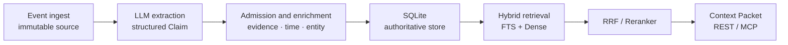

# HL-Mem

[](https://www.python.org/downloads/)
[](LICENSE)
[](docs/CHANGELOG.md)
[](https://github.com/lohr13/hl_mem/actions/workflows/test.yml)

[中文](README.md) | [English](#english)

<a id="english"></a>

## English

HL-Mem is an evidence-driven long-term memory system for AI agents. It converts immutable Events into sourced,
structured Claims, records factual change with a bitemporal model, and stores Episodes, Traces, and reusable Policies in
a separate Experience channel. SQLite is authoritative; LLM extraction plus lexical and vector retrieval make memories
usable.

**Every memory remains traceable to an immutable source event instead of becoming unsourced model text.**

## Data flow



## Quickstart

Python 3.12+ is installable. Python 3.13 is the sole CI-authoritative runtime; see the [support policy](docs/support.md)
for the exact commitment.

```bash
python -m pip install hl-mem
hlmem init
hlmem server
```

`hlmem init` asks you to select and verify an LLM, an Embedding provider, and an optional Reranker, then writes
`hl_mem.toml` and `.env` in the current directory. Once the service is running, use another terminal to store and recall
a memory:

```bash
hlmem remember "Alice prefers dark mode"
hlmem recall "What does Alice prefer?"
```

Recall output includes the Claim ID, relevance score, and an `event/<event-id>` evidence reference. Common management
commands are:

```bash
hlmem list
hlmem explain claim <claim-id>
hlmem forget <claim-id>
hlmem doctor
```

## Core capabilities

| Area | Capability |
|---|---|
| Write path | Idempotent Event ingest, structured extraction, admission checks, atomic persistence |
| Evidence and time | Event provenance, bitemporal state, TTL, decay, archival, and forgetting |
| Retrieval | Chinese FTS, Dense retrieval, RRF, optional Reranking, and bounded context |
| Governance | Conflict convergence, near-copy review, audit ledger, and explainable Claims |
| Experience | Episodes, Traces, Rewards, Policies, and Procedures |
| Interfaces | CLI, FastAPI REST, MCP stdio, and the Hermes adapter |

The [capability matrix](docs/capability-matrix.md) is authoritative for maturity, defaults, and validation evidence.

## Installation and integrations

### Run from source

```bash
git clone https://github.com/lohr13/hl_mem.git
cd hl_mem
uv sync
uv run hlmem init
uv run hlmem server
```

Development and tests use `uv` and the committed lockfile. See the [architecture](docs/architecture.md) and
[compatibility policy](docs/compatibility.md) for deployment, backup, restore, and runtime boundaries.

### Online models

Put non-secret settings in `hl_mem.toml`. Put each component credential in `.env` or its same-named process environment
variable. HL-Mem does not silently replace a failed real component with a Fake Provider. See the
[configuration reference](docs/configuration.md) for providers, models, and all supported fields.

### MCP

```bash
python -m pip install "hl-mem[mcp]"
hl-mem-mcp
```

See the [MCP guide](docs/mcp.md) for Codex, Claude Code, Claude Desktop, and Cursor examples.

### Hermes

After the HL-Mem service is healthy, install or upgrade the Hermes plugin:

```bash
hl-mem hermes install --hermes-home <HERMES_HOME>
hl-mem hermes upgrade --hermes-home <HERMES_HOME>
```

The plugin reads configuration from the Hermes root. Restart Hermes processes that already loaded the plugin after an
install or upgrade. See the [architecture](docs/architecture.md) for integration boundaries.

### Optional sqlite-vec

The default `sqlite_scan` backend fits small and medium local collections. Install the optional derived index when you
need sqlite-vec:

```bash
python -m pip install "hl-mem[sqlite-vec]"
```

Then set `recall.vector_backend` to `sqlite_vec`. The SQLite main tables remain authoritative.

## Common configuration

| TOML key | Default | Purpose |
|---|---:|---|
| `database.path` | `var/hl_mem.db` | SQLite database path |
| `llm.provider` | `dashscope` | Extraction model provider |
| `extraction.batch_max_events` | `5` | Events per extraction window |
| `extraction.batch_max_wait_seconds` | `120.0` | Maximum wait for a partial window |
| `embedding.mode` | `real` | Production embedding mode |
| `reranker.mode` | `off` | Optional reranking |
| `recall.vector_backend` | `sqlite_scan` | Vector retrieval backend |
| `recall.query_expansion_mode` | `off` | Query expansion policy |
| `image_describer.mode` | `off` | Image-description preview |

See the [configuration reference](docs/configuration.md) for complete defaults, allowed values, and secret boundaries.

## Quality and boundaries

The repository includes extraction, isolated retrieval, Chinese E2E, LongMemEval, MemDaily, and PerLTQA runners. See the
[evaluation guide](tests/eval/README.md) and [result index](evaluation/results/README.md) for protocols and current
artifacts; this README does not duplicate historical scores that quickly become stale.

HL-Mem is a SQLite-first, single-node memory system. It does not provide PostgreSQL, an external graph database,
distributed workers, high availability, or multi-tenant isolation. Provider plugins are trusted in-process code rather
than a security sandbox. See the [support policy](docs/support.md) for the full boundary.

## Documentation

| Document | Contents |
|---|---|
| [Documentation index](docs/README.md) | All maintained documentation |
| [Configuration](docs/configuration.md) | Settings, defaults, and secret boundaries |
| [Architecture](docs/architecture.md) | Data flow, modules, storage, and lifecycle |
| [API](docs/api.md) | REST endpoints and request contracts |
| [MCP](docs/mcp.md) | stdio configuration and tool contracts |
| [Provider plugins](docs/provider-plugins.md) | Extension API and trust boundary |
| [Compatibility](docs/compatibility.md) | Upgrade, restore, and public contracts |
| [Changelog](docs/CHANGELOG.md) | Current release and version history |

## Contributing

Issues and pull requests are welcome. See [CONTRIBUTING.md](CONTRIBUTING.md) for development, test, and commit guidance.

## License

Licensed under the [Apache License 2.0](LICENSE).
