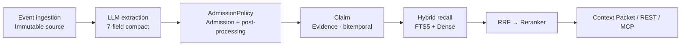

# HL-Mem

[](https://www.python.org/downloads/)
[](LICENSE)
[](docs/CHANGELOG.md)
[](https://github.com/lohr13/hl_mem/actions/workflows/test.yml)

[中文](README.md#中文) | [English](#english)

<a id="english"></a>

## English

HL-Mem is a local-first, evidence-driven long-term memory system for AI agents—not just another vector store. It turns immutable Events into structured Claims with evidence lineage, tracks change through a bitemporal model, and distills Episodes, Traces, and reusable Policies through a separate Experience channel; SQLite is all you need by default, with online models and sqlite-vec available when needed.

**Every memory is traceable to an immutable source event.**

## How data flows



## 30-second quickstart

Python 3.11+ is required. Run the first two lines in the current terminal; once the server starts, run the third in another terminal:

```bash
python -m pip install hl-mem
hlmem init --offline && hlmem server
hlmem remember "Alice prefers dark mode" && hlmem recall "What does Alice prefer?"
```

## Five-minute quickstart

Python 3.11+ is required. Install HL-Mem from PyPI:

```bash
python -m pip install hl-mem
```

In the directory where you want the local configuration and database, create an API-key-free setup and start the service:

```bash
hlmem init --offline
hlmem server
```

Open another terminal, then save and recall a memory:

```bash
hlmem remember "Alice prefers dark mode"
hlmem recall "What does Alice prefer?"
```

Recall prints the Claim ID, score, and evidence references together:

```text
[1] Alice prefers dark mode
    ID: <claim-id>
    分数: 0.8123
    证据:
      - event/<event-id>
```

`event/<event-id>` means the Claim is traceable to an immutable source event instead of being unsupported model text. Use `hlmem list` to see the Claim ID again, then pass it to `hlmem forget <claim-id>`, the REST detail endpoint, or MCP's `memory_explain`. The CLI output labels are currently Chinese. Offline mode is FTS-only keyword recall; fake embeddings preserve the storage shape but do not provide semantic search.

## Advanced installation and integrations

### Install from source

```bash
git clone https://github.com/lohr13/hl_mem.git
cd hl_mem
uv sync
uv run hlmem init --offline
uv run hlmem server
```

Use `uv sync --dev` for development and `hlmem doctor` for read-only diagnostics. SQLite must include FTS5, which is normally present in official Python distributions.

#### Contaminated host environments

Hosts such as the Hermes gateway may inject `PYTHONPATH` or `PYTHONHOME` values that point to their own virtual environment. Calling this repository's `.venv` Python directly can then import packages from the host and load incompatible binary extensions built for a different Python version. When running the source checkout from such a host, always use the launcher:

```bash
bash scripts/hlmem-python.sh -m hl_mem.cli doctor
```

For Windows `cmd.exe`, use:

```bat
scripts\hlmem-python.cmd -m hl_mem.cli doctor
```

The launcher clears both contaminating variables, switches to the repository root, and pins `.venv/Scripts/python.exe`. `start_hl_mem.sh` and `start_production.bat` delegate to the same entry point.

### Enable online models

From a source checkout, copy `config.example.toml` to a local `hl_mem.toml`, and copy `.env.example` as needed. Put each enabled component's independent key in `.env`: `LLM_API_KEY`, `EMBEDDING_API_KEY`, `RERANKER_API_KEY`, or `IMAGE_API_KEY`. Then enable the matching `extraction.mode`, `embedding.mode`, `reranker.mode`, or `image_describer.mode`. See the [configuration reference](docs/configuration.md) for the full schema.

### Connect Codex, Claude, and Cursor

Install the MCP extra with `python -m pip install "hl-mem[mcp]"` to use `hl-mem-mcp`, an official MCP Python SDK 2.x stdio server for Codex, Claude Code, Claude Desktop, and Cursor. See the [MCP guide](docs/mcp.md) for client configuration, its seven tools, and error behavior.

### Integrate with Hermes

Start HL-Mem and verify `curl --fail http://127.0.0.1:8200/healthz`, then run this from a source checkout:

```bash
uv run python scripts/install_to_hermes.py --hermes-home <HERMES_HOME>
```

The plugin is installed under `<HERMES_HOME>/plugins/hl_mem/`; restart Hermes afterward. The local HTTP adapter provides timeouts, circuit breaking, prefetching, and Episode/Trace synchronization.

### Always-on deployment and systemd

Use the stdlib-only `scripts/healthcheck.py` to probe `/healthz`, and leave restart and alerting to systemd, Windows service management, or the container orchestrator. A systemd unit's `WorkingDirectory` must contain `hl_mem.toml` and the optional `.env`.

See the [API reference](docs/api.md) for complete REST request contracts.

## Key Configuration

Non-secret settings come only from `hl_mem.toml`; secrets come only from `.env` or same-named process environment
variables. Common keys are listed below.

| TOML key | Code default | Purpose |
|---|---:|---|
| `database.path` | `var/hl_mem.db` | SQLite database path |
| `extraction.mode` | `fake` | `fake`, `real`, or `llm` |
| `extraction.batch_max_events` | `5` | Maximum same-session Events per extraction call |
| `extraction.batch_max_wait_seconds` | `120.0` | Maximum wait for a non-full extraction window |
| `embedding.mode` | `fake` | `fake` or `real` |
| `embedding.text_type` | unset | Optional `document` or `query` in native mode; omitted by default |
| `reranker.mode` | `off` | `off`, `fake`, `on`, or `real` |
| `image_describer.mode` | `off` | `off` or `on` |
| `llm.provider` | `dashscope` | `dashscope`, `zhipu`, or `openai_compatible` |
| `llm.structured_mode` | `json_object` | `auto`, `json_object`, or `json_schema` |
| `index.text_mode` | `natural` | `legacy`, `value_only`, `natural`, or `answerable`; natural uses only the subject and original-language value |
| `recall.vector_backend` | `sqlite_scan` | `sqlite_scan` (default) or `sqlite_vec`, which requires `hl-mem[sqlite-vec]` |
| `recall.dedup_threshold` | `0.95` | Near-copy folding threshold inside the bounded candidate window; `0` disables folding |
| `recall.dedup_candidate_limit` | `100` | Maximum recall candidates considered for near-copy folding |
| `recall.resurrection_mode` | `auto` | Bounded archived-only cold path when primary recall is insufficient; `off` disables it |
| `recall.query_expansion_mode` | `auto` | `off`, `auto`, or `always` |
| `decay.model` | `activation_halflife` | Decays activation by scope-specific half-life without changing confidence during routine decay |
| `dedup.scan_limit` | `200` | Maximum pending `dedup_pairs` reviewed per maintenance pass |
| `relation.discovery_mode` | `off` | `off`, `audit`, or `auto` |
| `recall.tag_channel_enabled` | `false` | Whether to enable the independent Tag retrieval channel |

Real components and external-call paths must be supplied with their own key; there is no automatic fake fallback.
`HL_MEM_*` environment variables no longer participate in application `Settings` configuration. `Settings` and
`config.example.toml` both use `5` / `0.15` for `recall.default_limit` / `recall.relevance_reranker_floor`; the example
deployment only raises `recall.relevance_relative_drop` from the code default `0.15` to `0.30` and keeps
`recall.relevance_keep_top1 = true`. Query expansion uses a separately configurable model with 5/6-second per-call/total timeouts.

### Vector search sizing

The default two-stage exact `sqlite_scan` backend is intended for local stores up to roughly 100,000 Claims; the actual
boundary also depends on embedding dimensions, concurrency, and latency targets. Near or above that scale, install
`hl-mem[sqlite-vec]` and explicitly set `recall.vector_backend = "sqlite_vec"` instead of treating a full vector scan as
an unbounded production index. SQLite remains authoritative and the sqlite-vec projection stays rebuildable.

When migrating an existing database from a legacy index, preview it read-only before explicitly running the backfill. The backfill updates `index_text`, FTS, and dense embeddings together; deployments using a real embedder must provide the corresponding key:

```bash
hlmem backfill-index-text --mode natural --dry-run
hlmem backfill-index-text --mode natural
```

### Upgrading from v0.27.x

v0.28.6 adds the optional `hermes.on_demand_recall_timeout_seconds` setting (default `8.0`) without changing the v0.27
defaults for `recall.resurrection_mode = "auto"` or `decay.model = "activation_halflife"`. A deployment skipping directly
from v0.26 can still retain the old behavior with:

```toml
[recall]
resurrection_mode = "off"

[decay]
model = "legacy_linear"
```

Stop the API, workers, and other writers and retain an offline copy of the primary database before upgrading. The first
v0.28 open automatically applies migrations 043/044. Immediately run `hlmem backup`; it creates and binds
`<database>.tombstones.db` and emits a v2 manifest. Protect the database backup, manifest, and tombstone ledger as one set.
Legacy v1 manifests cannot prove deletion history and v0.28 restore rejects them explicitly. Migrations do not adjudicate
historical conflicts or delete anomalies; those still require the explicit audit/repair workflow.

## Capabilities

| Core memory | Service and governance |
|---|---|
| **Memory correctness**<br>Idempotent ingestion, atomic writes, and exact deduplication<br>Conflict convergence plus three-entry deletion closure and anti-resurrection tombstones | **Experience channel**<br>Episodes, Traces, and rewards<br>Policies/Procedures and derived Observations |
| **Time and evidence**<br>Bitemporal Claims and relation edges<br>Evidence lineage, entity normalization, controlled archival, and physical forgetting | **Interfaces**<br>Stable FastAPI REST and Hermes Provider<br>Beta seven-tool MCP stdio interface |
| **Hybrid recall**<br>Chinese-aware FTS5 + Dense, fused by RRF with optional reranking<br>Relation/query expansion and token-budgeted context | **Evaluation**<br>Extraction v2, 112-case isolated retrieval, and 40-case Chinese E2E<br>Full LongMemEval, MemDaily, and PerLTQA runners |
| **Lifecycle**<br>Importance-aware TTL, activation decay, and archived cleanup<br>Manifest-v2 backup plus tombstone restore replay | **Governance tools**<br>7-field compact extraction + evidence-bound canonical slots<br>Job write progress, dangling audits, and active-Claim repair |

### Evaluation Results (published frozen protocols)

| Benchmark | Setup | Result |
|---|---|---:|
| LongMemEval · HL-Mem v0.25.2 | holdout50, Top-10 structured evidence | **43/50 (86.0%)** |
| LongMemEval · Full-Context upper bound | all sessions passed directly to the reader | **46/50 (92.0%)** |
| LongMemEval · Native RAG baseline | raw-session dense RAG, Top-10 | **45/50 (90.0%)** |
| MemDaily · v0.26.0 (2026-08-15) | 180 trajectories, extraction → recall → QA | **97.2% accuracy, F1 0.9855, R@5 97.5%** |
| PerLTQA · v0.26.0 (2026-08-15) | 378 questions, 10 characters, retrieval-only | **R@5 96.8%, MRR 82.8%** |
| Chinese E2E · v0.26.0 (2026-08-15) | 40 cases, live `deterministic-rubric-v2` | **38/40 (95.0%)**; R@5 **100%** |
| v0.27.1 behavior-change validation (2026-08-15) | Reuses the v0.26.0 figures; no full benchmark rerun for this release | **resurrection: 2 correct revivals, 0 false revivals, p95 12.7ms; activation: zero identity false archives with confidence semantics separated** |
| v0.28.0 maintenance and experiment validation (2026-08-16) | Reuses the published benchmarks above; no full benchmark rerun | **16/16 slot mismatches fixed with zero regressions; relation semantics reached 12% packet RAO with no entity@5 gain and was not productized** |

All Chinese baselines use `qwen3.7-text-embedding` and `qwen3-rerank`. PerLTQA directly ingests the corpus and measures retrieval without extraction; MemDaily and Chinese E2E run the extraction → recall → QA pipeline, using `qwen3.7-plus` for extraction and QA. MemDaily is scored on all 180 trajectories.

The LongMemEval comparison uses the `deepseek-v4-flash-0731` reader throughout, with reader thinking enabled and judge
thinking disabled; the benchmark reader and production recall/context packing are separate contracts. See the
[evaluation guide](tests/eval/README.md) for current isolated-retrieval and E2E regression semantics, and the
[results index](evaluation/results/README.md) for local artifact naming.

### Known boundary

- In the frozen v0.28 source-first A/B, the current model produced complete packet RAO for only 12% of relation cases;
  entity coverage@5 stayed at 34.7%, and no expansion-eligible edges were produced. That relation-semantics design and the
  C-series experiment arms were therefore not productized. Production retains compact Claims, source-bounded RAO rendering,
  and normal relation expansion; callers must not assume that dense, directional relation chains are reconstructed from flat text.

See the [capability matrix](docs/capability-matrix.md) for maturity, defaults, and evidence, and the [architecture guide](docs/architecture.md) for data flows.

## Project Status

- **Stable:** events and evidence, atomic writes, LLM extraction, embeddings, FTS + Dense + RRF, dual-time filtering, TTL/decay/archival, conflicts and deduplication, REST, Hermes, backups, and auditing.
- **Beta:** multi-query recall, relation candidate discovery, feedback-driven maintenance, extraction-entailment auditing, semantic-dedup auditing, MCP Server, benchmarks, and LongMemEval.
- **Experimental:** image evidence, extraction pre-filtering, the independent tag channel, and a PostgreSQL connectivity probe.

The current baseline is v0.29.0 with 47 immutable, forward-only migrations.

## Documentation

| Guide | Contents |
|---|---|
| [Documentation index](docs/README.md) | Navigation for maintained documentation |
| [Configuration reference](docs/configuration.md) | TOML keys, defaults, allowed values, and secret boundary |
| [Architecture](docs/architecture.md) | Layers, modules, pipelines, storage, and lifecycle |
| [API reference](docs/api.md) | REST endpoints and request conventions |
| [MCP guide](docs/mcp.md) | stdio arguments, Codex/Claude/Cursor setup, and tool-error behavior |
| [Compatibility policy](docs/compatibility.md) | Versioning and public contract guarantees |
| [Capability matrix](docs/capability-matrix.md) | Maturity, defaults, and evidence |
| [Changelog](docs/CHANGELOG.md) | Release history |

## Contributing

Issues and focused pull requests are welcome. See [CONTRIBUTING.md](CONTRIBUTING.md) for development setup, the seven CI
preflight checks, data-handling rules, and commit conventions.

## License

Licensed under the [Apache License 2.0](LICENSE). You may use, modify, and distribute this project subject to its terms, including the required copyright and license notices.
