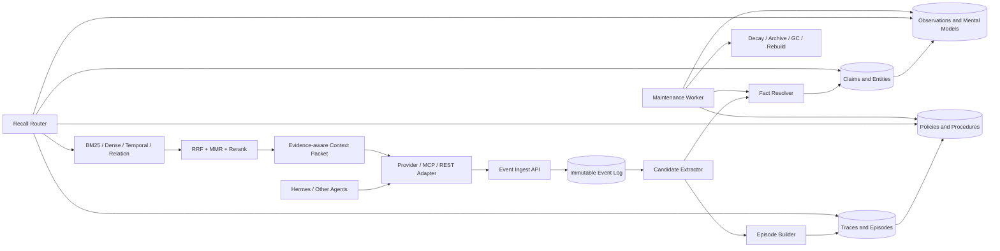

# HL-Mem 系统设计

- 文档版本：0.1
- 更新时间：2026-07-20
- 状态：目标设计，尚未实现

## 1. 系统边界

HL-Mem 负责从 Agent 事件中构造、维护和召回长期记忆。它不负责：

- 替代 Agent 当前会话的上下文窗口；
- 保存模型自身的通用预训练知识；
- 把所有聊天内容无条件变成永久事实；
- 直接执行网页、邮件或系统操作；
- 训练或微调主 Agent 模型。

HL-Mem 接受来自 Hermes、MCP Client 或 REST Client 的事件，并返回带证据、时间和作用域的上下文包。

## 2. 总体架构



> [首版不实现] 上图中的 MCP、Episode Builder、Traces/Episodes、Policies/Procedures 和 Mental Models 是后续目标架构；首版链路为 Provider/REST → Event → Claim/Observation → 混合召回。

### 2.1 部署单元

- `hl-memd`：HTTP/MCP 服务、读取请求和轻量写入。
- `hl-mem-worker`：消费持久化任务队列，执行提取、合并、归纳、Embedding 和维护。
- `hl-mem-hermes`：独立 Hermes MemoryProvider，只负责协议适配。
- `hl-mem-cli`：检查、导入导出、手动维护、解释和删除。
- SQLite 数据库：MVP 默认单文件，WAL 模式，单写者队列。

生产规模可将数据库替换为 PostgreSQL + pgvector；API 和领域模型不改变。

## 3. 记忆分类

记忆类型和变化速度是两个独立维度，禁止用一个 `realtime/permanent` 枚举同时表达。

### 3.1 类型

首版只实现 `event`、`claim`、`observation` 三种类型；其余类型保留目标设计并延后实现。

| 类型 | 含义 | 示例 |
|---|---|---|
| `event` | 不可变原始输入 | 用户消息、工具结果、任务结束事件 |
| `claim` | 从证据提取的原子事实 | 用户使用 PostgreSQL |
| `observation` | 多个 Claim 归纳出的稳定知识 | 用户通常偏好本地优先方案 |
| [首版不实现] `mental_model` | 围绕长期问题持续刷新的模型 | 用户画像、项目约定、当前目标 |
| [首版不实现] `trace` | 一个任务中的操作步骤 | 执行命令、错误、修复动作 |
| [首版不实现] `episode` | 同一任务的连续 Trace | 部署某服务的完整过程 |
| [首版不实现] `policy` | 从多个 Episode 归纳的策略 | Windows 下优先使用 PowerShell 原生命令 |
| [首版不实现] `procedure` | 经验证、可调用的操作流程 | 发布服务 Skill |

### 3.2 变化速度

首版只启用 `ephemeral` 和 `stable` 两档；其余档位保留语义，后续迭代启用。

| volatility | 语义 | 默认生命周期行为 |
|---|---|---|
| `ephemeral` | 分钟或小时内有效 | 必须有 `expires_at`，过期后禁止作为当前事实召回 |
| [首版不实现] `dynamic` | 经常变化 | 设置 `refresh_after`，旧值可以保留为历史 |
| `stable` | 长期稳定但仍可改变 | 无强制 TTL，允许被更高权威证据 supersede |
| [首版不实现] `pinned` | 用户显式要求长期保存 | 不自动降权或归档，但仍允许用户纠正和删除 |

“永久”表示不因普通衰减被自动清除，不表示永远正确。

## 4. 作用域和可见性

首版 visibility 只启用 `private` 和 `shared`，采用单用户本地部署；完整 `scope` 字段从 Day 1 保留，以便未来扩展而无需破坏数据模型。

每条记录必须包含完整作用域：

```text
tenant_id / user_id / project_id / agent_id / session_id
```

每条派生记忆包含：

```text
visibility = private | user | project | shared | global
```

其中 `user`、`project`、`global` 为 [首版不实现] 的可见性值，仅保留目标设计。

召回先做权限和作用域过滤，再做相似度计算。禁止检索后再依靠 Prompt 要求模型忽略越权内容。

建议规则：

- 用户偏好默认 `user`。
- 项目约定默认 `project`。
- Agent 自身操作经验默认 `agent + project`。
- 群聊事实必须记录 speaker 和 audience，不能写入所有参与者的私人 Profile。
- `global` 只允许管理员或显式策略写入。

## 5. 核心数据模型

### 5.1 events

不可变、可重放的原始事件。

```text
id                 ULID primary key
idempotency_key    unique
tenant_id/user_id/project_id/agent_id/session_id
event_type         message | tool_call | tool_result | feedback | task_end | explicit_memory
actor_type         user | assistant | tool | system
actor_id
content_json
occurred_at        事件在现实中发生的时间
recorded_at        系统写入时间
source_uri
content_hash
sensitivity
```

### 5.2 claims

原子事实采用双时间和版本状态。

```text
id
namespace_key
subject_entity_id
predicate
value_json
qualifiers_json
conflict_key
valid_from / valid_to       现实有效时间
recorded_from / recorded_to 系统知道该版本的时间
observed_at
expires_at / refresh_after
volatility
status      candidate | active | superseded | disputed | retracted | expired | archived
confidence / importance
source_authority
supersedes_id
extractor_version
```

### 5.3 evidence_links

所有派生结果必须链接证据。

```text
derived_type / derived_id
evidence_type / evidence_id
relation = supports | contradicts | derived_from | supersedes
weight
```

同一个派生结果不能引用自己或只引用另一个无原始证据的总结，防止总结循环自证。

### 5.4 derivations

首版只在本结构中使用 `observation`；`mental_model` 和 `session_summary` 为 [首版不实现]，字段设计保留。

保存 Observation 和 Mental Model。

```text
id
kind = observation | mental_model | session_summary
name / query
body
scope_json
status = active | stale | rebuilding | archived
confidence
generated_by_model / prompt_version
source_watermark
refresh_policy
updated_at
```

`source_watermark` 标记已经处理到哪个 Event/Claim，增量刷新只读取之后的新证据。

### 5.5 episodes、traces、policies、procedures

> [首版不实现] Experience 通道首版不创建 `episodes`、`traces`、`policies`、`procedures` 表，也不编写对应 Repository；以下设计冻结保留，未来通过新增 migration 和 Repository 实现。

经验通道：

```text
episodes: id, goal, status, started_at, ended_at, reward, outcome_summary
traces: id, episode_id, action, observation, error_signature, value, priority
policies: id, trigger, procedure, boundary, support, gain, status
procedures: id, name, invocation_guide, procedure_json, reliability, status
```

Policy 状态机：

```text
candidate -> active -> retired
```

Procedure 状态机：

```text
probationary -> active -> retired
```

失败的单次 Episode 不能直接生成 Skill；至少需要跨多个独立 Episode 的证据和验证。

### 5.6 retrieval_feedback

```text
query_id
memory_type / memory_id
rank / score
used_by_model
helpful
task_outcome
created_at
```

访问次数不能单独增加记忆价值，只有真实使用和正向任务结果才增加效用。

### 5.7 jobs

```text
id / job_type / payload_json
idempotency_key
status = pending | running | succeeded | failed | dead
run_after / leased_until
attempts / max_attempts
last_error
created_at / updated_at
```

定时脚本只负责插入幂等 Job；维护逻辑由 Worker 执行。

## 6. 写入流程

### 6.1 热路径

1. Adapter 发送事件和 `idempotency_key`。
2. 服务在一个短事务中写入 `events`。
3. 写入 `extract_event` Job。
4. 立即返回，不等待 LLM、Embedding 或总结。

用户显式执行“记住 X”时可走高优先级同步候选提取，但原始 Event 仍先落盘。

### 6.2 后台提取

首版按批次执行 LLM 提取：先由 event filter 排除低价值、重复或不应记忆的事件，再将候选事件组批，并设置可配置的每日 token 预算。预算耗尽时保留 Job 到下一预算周期，不阻塞事件热路径；批处理需记录 token 消耗、过滤原因和 extractor 版本。

Extractor 必须输出受 JSON Schema 约束的候选：

```json
{
  "claims": [],
  "episode_signals": [],
  "entities": [],
  "sensitivity": "normal",
  "should_memorize": true,
  "reason": "..."
}
```

`episode_signals` 字段为 [首版不实现] 的 Experience 兼容预留，首版不消费、不落 Experience 表。

写入前依次经过：

1. PII/秘密信息策略。
2. 实体归一化。
3. 时间解析和 volatility 分类。
4. 去重和 Conflict Resolver。
5. Evidence Link 写入。
6. 关键词和向量索引任务。
7. 受影响 Observation/Mental Model 的刷新任务。

Assistant 自己生成的自然语言回答默认 `source_authority=low`，不能仅凭该回答形成高置信 Claim。工具的真实结构化结果和用户关于自身的明确陈述可获得更高领域权威度。

### 6.3 Embedding 策略

首版默认使用阿里 `text-embedding-v4`（Qwen3-Embedding）输出 2048 维 Dense 向量，并同时接收 Sparse 向量；智谱 `embedding-3` 保留为 fallback。每条向量记录模型名、模型版本、维度和编码格式，避免不同模型结果误混。

存储接口从 Day 1 采用多 column 设计，为不同模型版本或重建期间并存预留独立 Embedding column。Dense 向量以 BLOB 存储并做小规模暴力余弦；Sparse 向量首版以稳定的 `index→weight` 格式序列化为 BLOB，显式记录格式版本和端序，后续规模增长再迁移到倒排表。

`text-embedding-v4` 每批最多 10 条。调用端使用 10 条满批、异步受控并发、增量缓存、QPS 动态限流和重试退避；离线任务优先使用 Batch API。

### 6.4 SQLite 写并发策略

SQLite 保持 WAL 模式，所有持久化写操作经单写 Worker 串行化，避免多个后台任务争抢写锁。Event 热路径先进入有界写队列，`events` 使用批量 insert 并在短事务中连同幂等键提交；读请求继续并发执行。Worker 以 Job/idempotency key 保证重试安全，并记录队列深度、批大小和写入延迟。

## 7. 矛盾检测

### 7.1 Conflict Key

```text
conflict_key = hash(namespace + canonical_subject + predicate + exclusive_qualifiers)
```

只在相同 Conflict Key、有效期可能重叠的 Claim 之间检测矛盾，避免让 LLM 扫描整个数据库。

### 7.2 判定顺序

1. 确定性类型比较：Boolean、Enum、Number、Entity ID、集合。
2. 时间关系：旧状态结束后新状态开始，通常是状态演化，不是不可解冲突。
3. 来源权威度：按领域策略比较，而不是使用全局固定优先级。
4. 仅在语义模糊时调用 LLM 分类：`entails | contradicts | compatible | uncertain`。

### 7.3 结果

- `entails`：合并证据和置信度，不重复生成事实。
- `compatible`：并存。
- `state_change`：旧 Claim 设为 `superseded`，`valid_to` 对齐新状态开始时间。
- `contradicts` 且新证据明显更强：旧 Claim `superseded`，但保留历史。
- `contradicts` 且双方接近：双方 `disputed`，召回时展示争议。
- `uncertain`：保持候选，等待更多证据或用户确认。

用户显式纠正自己的偏好时，最新明确陈述优先于旧陈述和行为推断。

## 8. 实时信息和长期知识

实时信息写成 Observation Event 和带 TTL 的 Claim，例如：

```text
服务 api-x 当前不可用
observed_at = 2026-07-20T10:00:00+08:00
expires_at = 2026-07-20T10:05:00+08:00
volatility = ephemeral
```

TTL 到期后：

- 历史问题仍可召回该 Claim；
- 当前状态问题禁止把它作为当前事实；
- 如果配置了 `refresh_action`，Recall Router 返回“需要重新查询”的信号；
- 旧 Claim 可以标为 `expired`，不能直接删除历史证据。

稳定知识没有默认 TTL，但仍有 `valid_from/valid_to` 和版本状态。`pinned` 只阻止普通衰减，不阻止用户纠正或删除。

## 9. 总结和归纳

### 9.1 Session Summary

> [首版不实现] 首版不生成 Session Summary，以下语义保留。

会话结束生成导航性摘要，主要用于找到原始 Episode/Event，不作为事实权威来源。

### 9.2 Observation

同一主题下有足够的独立 Claim 证据时生成。Observation 记录 proof count、来源和时间叙事。

### 9.3 Mental Model

> [首版不实现] 首版不生成或刷新 Mental Model，以下语义保留。

围绕稳定问题维护，例如：

- 用户偏好和沟通方式是什么？
- 当前项目的架构约束是什么？
- 有哪些未完成目标和长期风险？

刷新时只处理 `source_watermark` 后的新证据。任何依赖 Claim 被 retracted、deleted 或 disputed 时，相关 Mental Model 进入 `stale` 并排队重建。

### 9.4 防止归纳漂移

- Summary 不能无证据写回 Claim。
- 派生内容必须保存 prompt/model/version。
- 新归纳不得把旧归纳当作唯一证据。
- 同一个模型生成的重复表述不计为多个独立 proof。
- 高影响推论需要用户确认或多个独立来源。

## 10. 遗忘

遗忘分成四个动作：

1. `decay`：降低在线召回权重。
2. `expire`：不再作为当前事实，但保留历史。
3. `archive`：从主索引移除，可恢复。
4. `purge`：物理删除内容、Embedding、派生结果和缓存。

建议初始效用：

```text
utility = importance
        * confidence
        * usage_outcome_boost
        * source_authority
        * exp(-age / half_life)
```

其中：

- `pinned` 的普通时间衰减系数固定为 1。
- 正向任务结果提升 `usage_outcome_boost`。
- 只被召回但未被采用不提升效用。
- disputed、过期和长期未验证的动态 Claim 有额外惩罚。
- Active Procedure 主要根据成功率退休，而不是按创建时间退休。

首版自动维护只允许 decay、expire 和 archive。自动 `purge` 默认关闭。用户明确执行 forget 时立即级联 purge，并留下不含原文的最小审计 Tombstone，避免异步任务将其复活。

首版 forget 在同一受控事务/Job 中按 Evidence Dependency Graph 级联：删除目标 Event 原文、由其唯一支撑的 Claim、相关 `evidence_links`、Dense/Sparse Embedding BLOB 和索引缓存；仍有其他有效证据的 Claim 保留并重新计算，受影响 Observation 标为 `stale`。最后写入只含删除对象 ID/哈希、作用域、时间和操作版本的最小 Tombstone，后台 Job 在写回前必须检查该 Tombstone。

## 11. 召回

首版所有远程 Provider 调用统一设置 2 秒 timeout，并由 circuit breaker 在连续失败后快速失败；召回降级为仍可用的 FTS/本地通道，Provider 或 daemon 故障不得阻塞 Hermes 主流程。

### 11.1 Query Router

识别：

- `current_state`
- `historical`
- `profile`
- [首版不实现] `similar_experience`
- [首版不实现] `procedure`
- [首版不实现] `deep_reflection`

Router 同时提取 `reference_time`。没有显式时间时，当前状态使用请求时间；历史问题使用解析出的目标区间。

### 11.2 候选通道

- FTS/BM25：精确术语、文件名、错误码、中文关键词。
- Dense：语义相似。
- Fact Key：实体、谓词和属性。
- Temporal：有效区间和 `as_of`。
- Relation：一到两跳实体关系。
- [首版不实现] Procedure Trigger：任务意图与 Skill 触发条件。

并行候选经 RRF 合并、MMR 去重，再按以下因素重排：

```text
relevance × scope × temporal_validity × confidence × utility
```

### 11.3 Context Packet

默认预算建议 1,200–2,000 tokens，包含：

- 少量 pinned/core profile；
- 当前有效事实；
- [首版不实现] 相关历史 Episode；
- [首版不实现] 最多一个或两个 Procedure 摘要；
- 争议、过期或需要刷新提示；
- 每条结果的 Memory ID、时间、状态和 Evidence ID。

示例：

```text
[claim:01J... | active | valid_since=2026-07-01 | confidence=0.91]
用户当前项目默认使用 PostgreSQL。
Evidence: event:01J..., event:01K...
```

召回内容必须被标为“历史数据/证据”，不能被当作新的用户指令。Event 中出现的 Prompt Injection 不得提升为系统指令。

## 12. Hermes 接口

实现 Hermes 的独立 `MemoryProvider`：

| Hook | HL-Mem 行为 |
|---|---|
| `initialize` | 连接 daemon、健康检查、打开 session |
| `prefetch(query)` | 请求 Recall，按 token 预算返回 Context Packet |
| `sync_turn(messages)` | 异步写入 user/assistant/tool Events |
| [首版不实现] `on_session_end(messages)` | 关闭 Episode，提交总结和 Reward Job |
| `on_pre_compress(messages)` | 确保尚未持久化的 Event 落盘 |
| `on_memory_write(...)` | 将 Hermes 显式 MEMORY/USER 写入映射为 pinned Claim |
| [首版不实现] `on_delegation(task,result)` | 保存子 Agent Episode 与结果 |
| `shutdown` | flush、释放连接，不阻塞 Agent 退出 |

暴露给模型的工具保持最小集合：

- `memory_recall`
- `memory_save`
- `memory_forget`
- `memory_explain`

管理、迁移和批量维护只通过 CLI/API，不增加模型工具 Schema。

## 13. REST API 草案

```text
POST   /v1/events
POST   /v1/recall
POST   /v1/memories
POST   /v1/feedback
GET    /v1/memories/{id}
GET    /v1/memories/{id}/explain
DELETE /v1/memories/{id}
POST   /v1/admin/maintenance/{job_type}
GET    /v1/admin/jobs/{id}
GET    /healthz
```

所有写操作支持 `Idempotency-Key`。删除和导出必须验证作用域所有权。

## 14. 维护任务

建议默认计划：

| 周期 | Job | 作用 |
|---|---|---|
| 持续 | `extract_event` | 原子提取、实体和 Episode 信号 |
| 5 分钟 | `consolidate_claims` | 去重、冲突、Observation 增量合并 |
| 10 分钟 | `expire_ephemeral` | 标记 TTL 到期的实时 Claim |
| 每小时 | `reconcile_conflicts` | 重试 uncertain/disputed 候选 |
| [首版不实现] 每天 | `refresh_models` | 刷新 stale Mental Model |
| 每天 | `decay_and_archive` | 效用更新和低价值归档 |
| [首版不实现] 每周 | `induce_policies` | 跨 Episode 归纳 Policy/Procedure |
| 每月 | `gc` | 清理 orphan index、过期缓存和已批准删除项 |

所有任务按 namespace 加锁、可重试、可中断续跑，并记录输入水位和输出统计。

## 15. 安全与隐私

- 数据库文件和备份可配置加密。
- 日志默认脱敏，不记录 API Key、完整工具秘密和敏感 Event 正文。
- Event 标记 sensitivity，敏感记录不进入共享作用域。
- 删除按 Evidence Dependency Graph 级联。
- 导入的外部记忆默认低权威，防止 memory poisoning。
- 管理界面显示事实来源、派生链、状态和最后使用时间。
- 所有后台写入保留审计事件和算法版本。

## 16. 可观测性

至少记录：

- ingest latency、extract latency、recall P50/P95；
- 每种候选通道的 Recall@K 和实际采用率；
- stale-hit rate；
- contradiction precision、disputed backlog；
- 无证据派生率，目标必须为 0；
- 每轮注入 token；
- Job 失败率和积压；
- Archive/Forget/Purge 数量；
- Procedure 的试用次数、成功率和退休原因。
