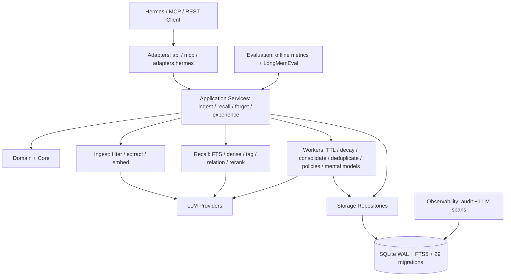

# HL-Mem 架构

- 文档版本：0.13.0
- 更新时间：2026-07-26
- 部署基线：SQLite-first，本地优先

本文将已经交付并受支持的“当前实现”与仍需演进的“目标架构”明确分开。能力成熟度和默认开关以
[capability-matrix.md](capability-matrix.md) 为准。

## 一、当前实现

### 1. 系统边界

HL-Mem 从 Agent 事件中构造、维护和召回长期记忆。它不替代当前会话上下文，不保存模型的通用预训练知识，
不直接执行网页、邮件或系统操作，也不训练主 Agent 模型。

系统接受 Hermes Provider、MCP Client 或 REST Client 的输入，返回带证据、双时间和作用域的上下文包。
默认部署使用 SQLite WAL + FTS5 + 向量 BLOB；SQLite 是产品主路径，不依赖外部数据库服务。

### 2. 当前架构图


```mermaid
flowchart TB
    C[Hermes / MCP / REST Client] --> A[Adapters: api / mcp / adapters.hermes]
    A --> S[Application Services: ingest / recall / forget / experience]
    S --> D[Domain + Core]
    S --> I[Ingest: filter / extract / embed]
    S --> R[Recall: FTS / dense / tag / relation / rerank]
    S --> W[Workers: TTL / decay / consolidate / deduplicate / policies / mental models]
    I --> L[LLM Providers]
    R --> L
    W --> L
    S --> P[Storage Repositories]
    W --> P
    P --> DB[(SQLite WAL + FTS5 + 29 migrations)]
    O[Observability: audit + LLM spans] --> DB
    E[Evaluation: offline metrics + LongMemEval] --> S
```

依赖方向以 `scripts/check_imports.py` 为可执行门禁：`core` 不依赖基础设施或适配层，`domain` 不依赖
`storage`、`api`、`workers`。

### 3. 代码结构

```text
src/hl_mem/
├── adapters/hermes/     Hermes Provider、HTTP client、episode mapper、plugin
├── api/                 FastAPI schemas 与 16 个 REST routes
├── application/         ingest、recall、forget 应用服务与事务边界
├── core/                向量数学
├── domain/              claim、时间、关系、实体、反馈等纯领域逻辑
├── evaluation/          离线评测、报告与 LongMemEval adapter
├── experience/          Episode、Trace、Policy 服务
├── ingest/              预筛、分块、提取、图片描述、Embedding
├── llm/                 Provider 解耦的 LLM client 与类型
├── mcp/                 MCP 工具契约
├── observability/       审计日志与 LLM call spans
├── recall/              多通道召回、排序、扩展、Procedure pipeline
├── security/            retention 策略
├── storage/             SQLite repositories、备份、29 个 migration
├── workers/             生命周期、关系发现、Policy 与 Mental Model 维护
├── components.py        组件工厂
├── settings.py          集中配置与校验
├── protocols.py         后端协议
└── cli.py               CLI 入口
```

### 4. 当前数据模型

| 类型 | 当前用途 | 持久化 |
|---|---|---|
| Event | 不可变原始输入与幂等摄入 | `events` |
| Claim | 从证据提取的原子事实 | `claims` |
| Observation | 多 Claim 派生的稳定知识 | `derivations` |
| Trace | Episode 内的工具调用或操作步骤 | `traces` |
| Episode | 一个任务的连续经验 | `episodes` |
| Policy / Procedure | 从经验归纳并供 Tool/Procedure intent 召回 | `policies` |
| Mental Model | 基于证据水位维护的长期模型 | `derivations` |

所有 Claim 使用 `valid_from/valid_to` 与 `recorded_from/recorded_to` 实现业务时间和记录时间分离。派生记忆保存
来源关系；源 Claim 撤回时关联 derivation 会标记为 stale。

### 5. 写入与经验通道

```text
Event → 幂等写入 → extract_event job → EventFilter / optional pre-filter
      → LLM extraction → fact_hash v2 → conflict_key → semantic dedup
      → evidence link / entity / embedding → Claim / Observation
```

Claim 写入、状态更新、supersede 和 evidence link 位于同一个 `BEGIN IMMEDIATE` 事务中。Experience 通道通过
Episode 和 Trace 记录执行轨迹与 reward，后台任务可归纳 Policy/Procedure 并维护 Mental Model。

### 6. 召回

```text
query → intent router → optional query expansion
      → FTS + dense + optional tag channel → RRF
      → 双时间/作用域过滤 → 多因子排序 → optional reranker
      → relation / observation / experience expansion
      → token budget packing → evidence-aware context packet
```

失败的可选外部能力按能力矩阵降级到确定性或原始查询路径，不阻断核心 SQLite 召回。

### 7. 生命周期与可观测性

- TTL 到期、访问/反馈 bonus、置信度衰减、归档、重分类和显式遗忘构成完整生命周期。
- Claim 撤回会清空向量并传播 stale；审计日志保留状态变化与自动决策。
- Job 记录 stage、processed/total、heartbeat 与 lease；LLM spans 记录 provider、model、token、延迟和状态。
- `healthz`、统计 API、离线 evaluation 和 LongMemEval adapter 提供运行与质量观测。

### 8. 部署和安全

- SQLite 单文件是默认和受支持的主部署形态；WAL、busy timeout、连接池和 migration runner 在存储层统一管理。
- 外部 LLM、Embedding、Reranker 和视觉 API 均由 Settings/环境变量注入，并使用超时、重试和明确降级。
- 召回在相似度计算前执行 namespace、subject 和时间过滤；图片本地路径受 allow-root 约束。
- 管理、备份、导入导出通过 REST/CLI 暴露，MCP 只暴露最小记忆工具集合。

## 二、目标架构

目标架构只描述演进方向，不代表当前承诺：

1. 将架构和发布数字进一步自动生成为 SSOT，避免 README、CHANGELOG 与维护指令再次漂移。
2. 以离线评测和生产审计数据推动 experimental → beta → stable，而不是仅以代码存在判断成熟度。
3. 在不破坏 `protocols.py` 契约的前提下演进检索后端；任何新后端必须先具备与 SQLite 主路径相同的一致性、
   migration、备份和故障降级测试。
4. 扩充历史快照升级、跨平台构建、依赖方向、覆盖率和发布制品门禁。
5. 对 Mental Model、Procedure 自动化和关系自动写入维持显式晋级标准，默认模式升级必须经过质量门槛与观察期。

SQLite-first 仍是目标架构的部署原则；目标不是迁移到某个外部数据库，而是在明确、可测量的容量或协作需求出现时，
再依据协议和基准决定是否增加受支持的存储实现。
