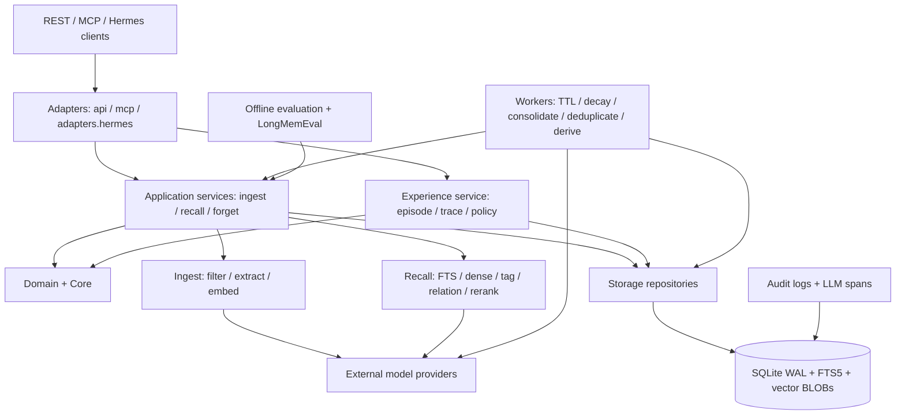
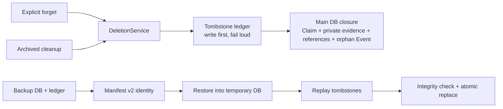

# HL-Mem Architecture

- Document baseline: v0.35.1
- Updated: 2026-08-29
- Deployment baseline: local-first, SQLite-first

This document describes the shipped architecture. Feature maturity and default modes are tracked in the
[capability matrix](capability-matrix.md). Earlier proposals and completed designs are retained in the
[historical archive](archive/) and do not define the current roadmap.

## 1. System Boundary

HL-Mem turns Agent events into durable, evidence-backed context. It does not replace the active conversation window,
execute external tools, store general model knowledge, or train the host Agent. REST, MCP, and Hermes clients submit
events or recall queries and receive structured memory with temporal and provenance metadata.

SQLite WAL is the supported primary store. FTS5 provides lexical retrieval and vector embeddings are stored as BLOBs for
the default two-stage exact `sqlite_scan` backend; deployments may explicitly install and select `sqlite_vec` for a native
vector index while SQLite remains the source of truth. External LLM, embedding, reranking, and vision providers are
optional capabilities injected through settings; they are not storage dependencies.

HL-Mem is a local, single-tenant service intended to run inside one trusted deployment. `namespace` is a relevance/profile
label that keeps recall, Episodes, Policies, and maintenance work in separate soft partitions. It is not an authentication,
authorization, encryption, or side-channel boundary. The deprecated name `tenant_id` remains only as a compatibility
alias; the presence of either name does not provide SaaS multi-tenancy, RBAC, quotas, billing isolation, or per-tenant keys.

## 2. Layered Architecture


```mermaid
flowchart TB
    C[REST / MCP / Hermes clients] --> A[Adapters: api / mcp / adapters.hermes]
    A --> S[Application services: ingest / recall / forget]
    A --> X[Experience service: episode / trace / policy]
    S --> D[Domain + Core]
    X --> D
    S --> I[Ingest: filter / extract / embed]
    S --> R[Recall: FTS / dense / tag / relation / rerank]
    W[Workers: TTL / decay / consolidate / deduplicate / derive] --> S
    I --> L[External model providers]
    R --> L
    W --> L
    S --> P[Storage repositories]
    X --> P
    W --> P
    P --> DB[(SQLite WAL + FTS5 + vector BLOBs)]
    O[Audit logs + LLM spans] --> DB
    E[Offline evaluation + LongMemEval] --> S
```

The executable import gate in `scripts/check_imports.py` protects the dependency direction: `core` has no infrastructure
dependencies, and `domain` does not import `storage`, `api`, or `workers`. Adapters translate protocols; application
services own use cases and transaction boundaries; repositories own persistence.

## 3. Code Structure

```text
src/hl_mem/
├── adapters/hermes/          # Hermes provider, client, episode mapping, thin plugin delegate
├── api/
│   ├── server.py             # FastAPI assembly, middleware, exception mapping, 17 REST routes
│   └── schemas.py            # Pydantic request and response contracts
├── application/
│   ├── answerability.py      # Shared supported/hard/soft abstention semantics
│   ├── context_packet.py     # Context Packet v1 assembly and exposure materialization
│   ├── deletion.py           # Fail-closed physical deletion closure and tombstone replay
│   ├── entity_resolution.py  # Typed canonical-entity projection and rekey orchestration
│   ├── ingest.py             # IngestService and atomic Claim write path
│   ├── plan_fulfillment.py   # Result-to-plan reconciliation and governance CAS
│   ├── recall.py             # RecallService orchestration and context packing
│   ├── forget.py             # Explicit-forget adapter over DeletionService
│   └── restore.py            # Restore replay orchestration before database visibility
├── core/
│   └── vector.py             # Pure cosine-similarity math
├── domain/
│   ├── claims/               # Claim model, conflict, dedup, retention, slot/tag query logic
│   ├── action_coordinates.py # Local plan/trade action-family coordinates
│   ├── content.py            # Multimodal content protocol
│   ├── entity.py             # Entity normalization
│   ├── entity_coordinates.py # Typed canonical entities and versioned alias proofs
│   ├── governance.py         # Decision envelope, fingerprints, and rollback checks
│   ├── instruments.py        # Deterministic instrument target extraction
│   ├── plan_fulfillment.py   # Plan coordinates and outcome rules
│   ├── recall.py             # Recall intents and domain rules
│   ├── relations.py          # Memory relationship model
│   └── temporal.py           # Dual-time visibility
├── evaluation/               # Benchmarks, metrics, reports, LongMemEval adapter
├── experience/
│   └── service.py            # Episode, Trace, reward, Policy operations
├── ingest/
│   ├── budget.py             # Daily token budget
│   ├── chunking.py           # Structure-aware chunking
│   ├── admission.py          # Pure deterministic Claim admission policy
│   ├── embedder.py           # Fake/real embedding implementations
│   ├── event_filter.py       # Event value filtering
│   ├── extractors.py         # Fake/LLM extractor interface
│   └── llm_extractor.py      # Compact extraction and full-schema post-processing
├── llm/
│   ├── client.py             # Provider-independent LLM client
│   ├── providers.py          # Bailian, Zhipu, OpenAI-compatible providers
│   └── types.py              # LLM request/response types
├── mcp/
│   └── server.py             # Seven-tool MCP contract
├── observability/            # Audit events and persistent LLM call spans
├── recall/
│   ├── observation.py        # Derived-memory assembly
│   ├── entity_query.py       # Query mention resolution and observe/enforce constraints
│   ├── ranking.py            # Multi-factor ranking
│   ├── relation_expansion.py # One-hop relation expansion
│   ├── reranker.py           # Optional reranking (model configured via TOML)
│   ├── staged_pipeline.py    # FTS + dense + optional tag channel and RRF
│   └── trace.py              # SearchTrace diagnostics and metrics
├── security/                 # Retention and content policy
├── storage/
│   ├── backup.py             # Online SQLite backup
│   ├── claims.py             # Claim repository
│   ├── database.py           # Connection management and migration runner
│   ├── events.py             # Immutable Event repository
│   ├── entities.py           # Canonical entity, alias, relation, and Claim-link repository
│   ├── evidence.py           # Evidence links
│   ├── experience.py         # Episode/Trace/Policy repository
│   ├── jobs.py               # Durable job queue
│   ├── governance.py         # Reversible governance action ledger
│   ├── plan_fulfillments.py  # Plan outcomes and deterministic candidate access
│   ├── relation_proposals.py # Auditable relation candidates
│   ├── tombstones.py         # Independent versioned deletion-ledger adapter
│   ├── usefulness.py         # Feedback usefulness aggregation
│   ├── candidate_materializer.py # Shared temporal/namespace candidate hydration
│   ├── sqlite_vec.py         # Optional sqlite-vec projection and search backend
│   └── migrations/           # 57 immutable SQL migrations (001-057)
├── workers/
│   ├── worker.py             # Job leasing, progress, heartbeat, maintenance loop
│   ├── auto_resolve_conflicts.py # Bounded deterministic L0 conflict orchestration
│   ├── job_handlers.py       # Job handlers, registry, and dispatch boundary
│   ├── integrity.py          # Bounded dangling-reference reporting
│   ├── ttl.py                # Importance-aware expiry
│   ├── decay.py              # Activation/legacy decay and archival
│   ├── consolidate.py        # LLM semantic consolidation
│   ├── deduplicate.py        # Cross-subject semantic deduplication
│   ├── backfill_expires_at.py# TTL backfill utility
│   ├── discover_relations.py # Relation proposal discovery
│   ├── mental_models.py      # Mental Model maintenance
│   ├── rebuild_usefulness.py # Usefulness rebuild
│   └── induce_policies.py    # Experience-to-Policy induction
├── components.py             # Central component factories and health state
├── config.py                 # Shared constants
├── config_loader.py          # Strict TOML + four-secret configuration loader
├── errors.py                 # Application exception family
├── http_utils.py             # Retry and timeout utilities
├── lifecycle.py              # Central state-transition guards
├── protocols.py              # Backend and component protocols
├── settings.py               # Settings schema, defaults, metadata, and validation
└── cli.py                    # Maintenance, backup, import/export, evaluation CLI
```

## 4. Memory Model

HL-Mem uses two event-sourced channels:

| Type | Role | Persistence |
|---|---|---|
| Event | Immutable source input and idempotency boundary | `events` |
| Claim | Atomic fact extracted from evidence | `claims` |
| Observation / Mental Model | Stable knowledge derived from multiple Claims | `derivations` |
| Episode | One continuous task experience | `episodes` |
| Trace | Tool call or action inside an Episode | `traces` |
| Policy / Procedure | Reusable guidance induced from experience | `policies` |

Claims carry `valid_from`/`valid_to` for business validity and `recorded_from`/`recorded_to` for database knowledge time.
This supports both “what was true then?” and “what did the system know then?” Evidence links connect Claims to source
Events. Derivations retain source relations and become stale when a source Claim is withdrawn.

Typed canonical entities provide stable coordinates for `person`, `agent`, `device`, `environment`, `instrument`,
`project`, and `topic`. Versioned aliases resolve to exactly one same-type canonical entity and retain their proof;
`topic` cannot become a Claim subject. Claim links record subject, actor, target, device, environment, project, and about
roles. Missing proof or a cross-type collision remains unresolved instead of falling back to string equality.

Classification combines a controlled operational slot with open topic tags. Slots drive conflict, retention, and
preference behavior; tags improve discovery without becoming hard schema.

Context Packet v1 is a delivery projection rather than another stored memory type. It freezes the final ordered,
token-budgeted items for one recall, carries evidence and answerability, and assigns a fresh `feedback_id` to each
delivered item so later feedback can be attributed to that exposure.

Answerability is shared across the application API, Context Packet, benchmark readers, and evaluation runners:
`no_evidence` is hard abstention with no retrieval candidate, while `low_confidence` is soft abstention with candidates
whose confidence signal remains below the supported threshold. Readers short-circuit only `no_evidence`; observe-mode
readers answer `low_confidence` and preserve its soft metadata. Aggregate no-answer metrics include both and retain
separate hard/soft diagnostics.

## 5. Write Pipeline

```text
Client
  → POST /v1/events or atomic POST /v1/events/batch
  → idempotent Event insert + one durable extract_event Job per Event
  → Worker atomically leases a bounded same-session window (max 4 Events / max 2 seconds)
  → per-Event EventFilter / optional deterministic pre-filter
  → compact seven-field LLM extraction with speaker, turn, source_event_indices and temporal anchoring
  → deterministic JSON repair + compact/legacy schema validation + bounded retry
  → AdmissionPolicy (notability, evidence, secret, operational-snapshot checks)
  → full-schema reconstruction (choice, qualifiers, time, entities, slot/tags, grounded lesson signal)
  → typed entity/alias resolution and deterministic instrument-target extraction
  → subject guard / scope normalization / canonical predicate projection
  → index_text construction (legacy / value_only / natural / answerable)
  → fact_hash v2 exact deduplication
  → canonical attribute + conflict_key deterministic conflict resolution
  → observation-gated deterministic temporal link for atomic availability or explicit anchored price replacement
  → LLM four-way consolidation for gray-zone conflicts
  → conservative same-subject near-copy reuse (structure + lexical + cosine + protected atoms)
  → best-match semantic candidate generation (domain constant 0.82)
  → entity normalization + slot/tags + retention/expiry calculation
  → embedding generation and one evidence link per declared source Event
  → Claim commit + idempotent plan-reconciliation job when the new Claim is a result candidate
```

The Claim mutation sequence—status update, Claim insert, conflict-candidate attach/revision bump, supersede operation,
and evidence link—runs in one
`BEGIN IMMEDIATE` transaction. External calls use configured timeouts and retries; errors are recorded rather than
silently swallowed. Idempotent retries return the original Event instead of duplicating work.

The extraction output is governed before persistence. The LLM emits a seven-field candidate; a pure `AdmissionPolicy`
checks notability, locatable evidence, secret/empty values, and completed operational snapshots. Stable preference and
architecture candidates are not rejected merely because their text contains words such as “fix”, “delete”, or “test”,
while numeric, IP, and port evidence must match exactly. Compact and legacy output then share the same admission path and
deterministic post-processing reconstructs choice semantics, qualifiers, occurrence time, entities, slots, and tags.
Invalid or shared placeholder subjects are rebound to a valid canonical entity when possible and otherwise isolated per
event. `source_event_indices` is validated against the current window, used to select evidence text for admission, and
persisted as separate Event evidence links; speaker remains an Event property instead of being conflated with Claim
subject. Each decision emits an audit reason code. Claim FTS and dense embeddings consume the persisted `index_text`;
changing `index.text_mode` therefore supports controlled representation A/B without changing the rest of recall.

The localized Chinese and English prompts share atomicity rules for compound facts, explicit actions/relationships,
named-entity fidelity, one-off events, and enumerations. Prompt and extractor identities are recorded by the code and
evaluation manifests instead of being duplicated in this document. A raw structured response containing exactly the 20
allowed Claims emits a `claim_limit_reached` audit warning because the model may have silently omitted additional facts;
the schema limit itself remains unchanged.

The released extractor prompt remains the pre-v0.31 prompt because the lesson-notability experiment was sealed. A
deterministic post-processor can emit a grounded `lesson_signal`, but its default `observe` mode cannot promote scope or
importance. Price target resolution is separately enforced only for exact qualified codes or unique typed instrument
aliases; unresolved targets remain fail-closed.

The bounded window has only two controls: count and maximum wait. An idle timer is intentionally absent because
`sync_turn` already writes the user/assistant pair atomically; adding another debounce state would increase starvation and
recovery complexity without improving evidence semantics. Explicit memories, non-message Events, and Events without a
session take the immediate single-Event path. LongMemEval queues the same Events and drains this same Worker path.

Observation and Mental Model derivation is a separate maintenance path, not part of the Claim write transaction. The
mental-model worker evaluates active evidence after ingestion and writes or refreshes derivations when its evidence rules
are satisfied.

Explicit `POST /v1/memories` writes a pinned memory through the same application boundary. The experience channel writes
Episodes and Traces separately, accepts reward/outcome feedback, and lets workers induce reusable Policies.

## 6. Recall Pipeline

```text
POST /v1/recall
  → RecallIntent routing and optional bounded query expansion
  → namespace / subject / dual-time visibility filters
  → FTS5 BM25 + dense cosine + optional tag candidates
  → reciprocal-rank fusion (RRF)
  → recency + importance + access + scope + helpfulness scoring
  → optional reranking (model configured via TOML)
  → bounded equivalent-group folding with evidence union
  → relation, Observation, and Experience expansion
  → response shaping: legacy results or token-budgeted packet/both/Hermes delivery
  → optional evidence-aware Context Packet + optional SearchTrace
```

Lexical retrieval uses deterministic pre-tokenization selected by the active `recall.fts_language`: jieba for Chinese,
Porter stemming for English, and mixed raw-plus-stem terms in `auto`. Claims and Events pass the same active setting to
write, query, and rebuild paths. An `auto` query keeps raw terms and stemmed terms in separate conjunctive branches, so
v0.24.0 raw-only rows and current raw-plus-stem rows remain searchable without weakening every token to a global OR.
Legacy trigram/raw tables remain only for the rollback window and are not queried by the production path.
Dense retrieval scans a configured candidate bound before scoring. Optional provider failures degrade to deterministic or
original-query paths so the SQLite retrieval core remains available.

Query entity resolution runs before the existing channels. In the released `observe` mode it records mention, proof,
coverage, and the filtered shadow result but leaves the production candidate set wide. It adds no channel, boost, or
ranking weight. A future `enforce` setting is allowed only after frozen production-shaped coverage evidence passes its
gate; ambiguous or multi-entity queries always remain wide in v0.31.

`memory_relations` has its own valid-time interval, independent of each endpoint Claim. New edges start at creation;
existing terminal-transition paths close connected edges when a Claim becomes retracted, superseded, or expired. Every
relation-expansion hop checks the edge interval and both endpoint Claims for namespace, status, valid-time, and recorded-time
visibility. Relation edges therefore cannot keep an otherwise invisible terminal Claim reachable.

For `context_packet` / `both` responses and Hermes delivery, Context Packet assembly is the last recall stage. Passive injection
governance defaults to echo `enforce` and freshness `render`; it runs echo filtering before reranking and risk-gated freshness decoration after reranking but before
the selected delivery path's token budget is applied. Any intent-specific quota selection therefore measures decorated
text. The legacy response can materialize exposures from its returned item set without invoking packet-only packing.
Only the materialized items receive feedback exposure rows. Hermes may cache the receipt-free retrieval bundle, but it
requests fresh packet receipts for each delivery and marks their migration-035 `injected` field only after rendered text
crosses the Agent host/model input boundary; persistence failure degrades feedback attribution without discarding the
recalled text.

## 7. Conflict, Deduplication, and Lifecycle

The write path applies progressively more expensive checks: bounded JSON `fact_hash` equality, canonical-attribute
`conflict_key`, then semantic similarity. Only mutually exclusive slots form group conflicts. One current open case owns
all candidates for `(namespace, group_key, generation)`; the legacy left/right columns are compatibility representatives,
not pairwise storage. Attaching a candidate and incrementing `revision` is atomic with Claim insertion. Automatic
maintenance consumes a persistent dirty queue, processes only the current active generation under count/time budgets and
per-case backoff, and uses the shared governance ledger plus revision/fingerprint CAS for every mutation. The v0.31
release default is `conflict.auto_mode="l0_only"`: only the sealed 37/37 deterministic L0 rules may mutate Claims. L1 is
disabled, and gray cases become `manual_required`; `off` is the only non-mutating conflict mode. The retired
`observe`/`enforce` values and built-in judge configuration fail closed during startup. A stable `manual_required` case is
not scanned or updated again until a trigger marks it dirty. Review returns the
generation, revision, and complete candidate set; select/reject requires `expected_revision`, with stale requests failing
409 before mutation. Candidate counts above the configured auto threshold remain manual. The schema reserves generation
boundaries for v0.29. When a group already has a terminal generation, an exact reassertion of its active winner only adds
evidence; a different current value creates the next manual-review generation without mutating the terminal case. This
bounded reopen path deliberately adds no pagination, cooling, split/reclassification, rollup, compression, or cold
storage behavior.

The `temporal-v1` extension runs only after exact deduplication and the existing mutually-exclusive group resolver. A new
Claim must be explicitly gated as an `observation`; legacy `unknown` values never authorize a link. Atomic online/offline
availability and explicitly anchored price replacements retain their conservative guards for subject, attribute,
predicate, qualifiers, source authority, valid time, currency, and billing unit. Price and measurement snapshots add three
deterministic branches implemented in `src/hl_mem/domain/claims/temporal_links.py`:

- `snapshot_advance`: different coordinates in the same subject/measurement series converge automatically. The newer
  snapshot becomes the current tip and closes the older tip; an older snapshot ingested later is closed as backfill, so it
  cannot replace the current value.
- `distinct_series`: different measurements or different proven instruments coexist without creating a conflict case.
- `uncertain`: same-coordinate revisions, implicit replacements, missing or inconsistent coordinates/subjects,
  authority/unit mismatches, and mixed active-tip ordering remain fail-closed in the existing manual pipeline. The case
  rationale includes the evaluator reason, such as `snapshot_coordinate_equal`, `price_replacement_not_explicit`, or
  `snapshot_order_mixed`.

For price Claims, the series coordinate uses `(axis, canonical_target_entity_id, snapshot_date)`. Exact qualified codes
and unique typed aliases are enforced by default; a missing target, ambiguous market, currency/unit mismatch, or mixed
date remains `uncertain`. `config.path`, `config.network`, and every non-exclusive operational slot remain denied. Proven
convergence reuses the existing atomic supersede transaction; ambiguity reuses the pair-style manual case. No general
latest-wins classifier is added.

Near-copy control deliberately shares one conservative predicate across ingestion, maintenance, and recall. It requires
compatible namespace, predicate, canonical slot/attribute, qualifiers, and validity; high cosine and lexical near-copy
agreement must also preserve the order and multiplicity of protected numbers, versions, dates/weekdays, paths, polarity,
relative day periods, quoted values, obvious proper names, and entity mentions in the Claim value. Cross-subject folding
is limited to a value-verified `user` to `user's <entity>` projection; arbitrary people are never merged. Ingestion may
reuse an existing same-subject Claim and add evidence. Maintenance reviews a bounded `dedup_pairs` candidate set,
including the slot-aware cross-subject branch whose governing typed entity has explicit proof. Deferred candidates rotate
by `reviewed_at` so one unsafe high-similarity pair
cannot starve the queue. Recall rechecks those deterministic edges inside its existing candidate bound and
applies the same predicate dynamically within that bound when a cross-subject near-copy has no persisted edge. It keeps
the highest-ranked representative, exposes folded member IDs, and unions evidence in memory. Pairs that fail any guard
remain independently retrievable. The physical survivor/evidence/supersede path exists behind typed-entity and
protected-atom guards, but `dedup.audit_only=true` remains the release default because E2 was sealed; no v0.31 default
applies an audited pair.

Plan fulfillment remains a Claim lifecycle projection rather than a task system. A result Claim is matched only to one
logical plan group with the same typed target, action family, direction, Decimal quantity/unit, account, and valid-time
window. Complete, cancel, and replace close only the plan's `valid_to`; partial outcomes accumulate exactly and close the
plan only when quantity conservation reaches the planned amount. `recorded_to`, Claim status, and `superseded_by_id` are
unchanged. Outcomes, explanatory relations, and governance actions are written atomically. E5's deterministic arm passed
all 143 frozen scenarios, so `plan.fulfillment_mode="enforce"` is the released default; incomplete or non-unique
coordinates abstain.

Retention is a pure function of scope and importance. Ephemeral memories expire; temporal and permanent memories decay on
different schedules; access and sufficiently supported helpful feedback can extend useful life within configured caps.
Archival clears embeddings. Physical deletion is deliberately narrower and fail-closed:


```mermaid
flowchart LR
    F[Explicit forget] --> D[DeletionService]
    C[Archived cleanup] --> D
    D --> L[Tombstone ledger<br/>write first, fail loud]
    L --> X[Main DB closure<br/>Claim + private evidence + references + orphan Event]
    B[Backup DB + ledger] --> M[Manifest v2 identity]
    M --> R[Restore into temporary DB]
    R --> P[Replay tombstones]
    P --> A[Integrity check + atomic replace]
```

The live forget and archived-cleanup entries use the same closure. Active, archived, and superseded Claims are handled by
explicit rules; candidate, disputed, expired, or open-manual states are refused when deletion semantics are ambiguous, and
retracted replay is idempotent. Restore is the third entry: it validates the sidecar identity and replays every tombstone
before the temporary database can replace the visible target. The ledger stores identity hashes and closure metadata, not
sensitive Claim text. Integrity audit reports bounded evidence, relation-endpoint, derivation, and supersede dangling samples
without auto-deleting them.

## 8. Interfaces

| Interface | Responsibility | Maturity |
|---|---|---|
| REST / FastAPI | Full ingestion, recall, experience, feedback, jobs, and health surface | Stable |
| Hermes Provider | Agent-facing memory adapter with timeout and circuit breaker | Stable |
| MCP | Seven-tool MCP SDK 2.x low-level Server over stdio | Beta |
| CLI | Worker, maintenance, backup, import/export, benchmark operations | Stable |

### Public REST route map

| Method | Path | Application responsibility |
|---|---|---|
| `GET` | `/healthz` | Process/component liveness, in-memory metrics, and unresolved conflict count |
| `POST` | `/v1/events` | Idempotent Event ingestion |
| `POST` | `/v1/events/batch` | Atomic ingestion of a bounded Event group |
| `POST` | `/v1/extract/dry-run` | Non-persistent Claim extraction |
| `POST` | `/v1/consolidate` | Scoped conflict-consolidation job |
| `POST` | `/v1/recall` | Hybrid, evidence-aware recall |
| `POST` | `/v1/memories` | Explicit pinned-memory ingestion |
| `DELETE` | `/v1/memories/{memory_id}` | Tombstone-backed physical deletion closure |
| `POST` | `/v1/episodes` | Episode creation |
| `GET` | `/v1/episodes` | Episode listing |
| `GET` | `/v1/episodes/{episode_id}` | Episode detail |
| `PATCH` | `/v1/episodes/{episode_id}` | Episode transition and reward |
| `POST` | `/v1/episodes/{episode_id}/traces` | Trace append |
| `POST` | `/v1/feedback` | Retrieval feedback and correction |
| `GET` | `/v1/policies` | Induced Policy listing |
| `GET` | `/v1/jobs` | Durable job state |
| `GET` | `/v1/stats` | Storage and token counters |

Request fields, response behavior, and examples live in [api.md](api.md). FastAPI also publishes generated OpenAPI
documentation at `/docs` while the service is running.

## 9. Storage and Operations

The database layer owns WAL mode, busy timeout, connection lifecycle, online backup, and ordered immutable migrations.
Workers use durable jobs with leases, heartbeat, stage, and processed/total progress. `worker.py` owns leasing, the
maintenance loop, and process lifecycle; `job_handlers.py` owns the handler registry and dispatch boundary. Extraction
persists per-window and cumulative written-Claim counts in the existing `progress_detail_json` before `complete`, so a
failed Job is distinguishable from a zero-write Job. A separate connection renews every job in a leased extraction window
while work is running; token-guarded terminal updates must cover the complete window or the worker reports `lease_lost`
instead of success. Audit logs record state changes and
automatic decisions; LLM spans record operation, provider, model, status, token counts, and latency. The async `/healthz`
route reports process-local component metrics, the configured vector backend, and the unresolved conflict count through
the application lifecycle connection; it does not call external providers. `/v1/stats`, offline evaluation, and the
LongMemEval adapter provide broader database-backed operational and quality visibility. LongMemEval ingestion mirrors
production event semantics: each conversation turn is an Event with its real actor role, while session identity and the
turn/span locator remain provenance metadata. Its reader consumes Claim evidence first and enables a bounded raw-event
fallback only for assistant-answer questions or explicit references to an earlier list, table, or script. That fallback
uses namespace-scoped lexical OR retrieval, selects one assistant turn, deduplicates by Event ID, and shares the existing
1,200-token evidence allowance; it does not introduce a second turn-vector schema.
The stdlib-only `scripts/healthcheck.py` probe exposes `/healthz` to deployment supervision on every platform;
systemd, Windows service management, or the container orchestrator owns restart policy and alerting.

The 57 immutable SQL migrations are applied in order. Migrations 035–037 introduced the injected feedback boundary,
tokenized FTS v2, and vector-backend dirty state. Migration 038 registers a Python data migration that canonicalizes
persona subjects and rebuilds derived identities under a write transaction; large databases need a backup and maintenance
window. Migration 039 adds nullable Event locator metadata, migration 040 adds the bounded deferred-task queue used
after extraction HTTP 429 retries are exhausted, migration 041 prevents a second active claim from entering a
mutually exclusive conflict group on any INSERT or UPDATE path, migration 042 adds activation lifecycle state, and
migration 043 binds the main database to its deletion-ledger identity, and migration 044 adds valid-time windows to relation
edges and closes them on terminal Claim transitions. Migration 045 adds group candidates, generation/revision, a persistent
review queue/cursor, and dirty triggers; migration 046 adds bounded-retention indexes and retires historical below-floor
pending dedup candidates. Migrations 047–049 add assertion kind and dedup injection provenance before removing the guarded
legacy tags FTS table. Migrations 050–054 add the governance action ledger, conflict policy versioning, typed canonical
entities and Claim links, plan outcomes, and slot-aware dedup strategy metadata. Migrations 055–056 add portable
database-boundary auditing for Claim UPDATE/DELETE mutations. Migration 057 retires non-terminal legacy conflict-judge
jobs, clears their leases, and marks linked open cases dirty without modifying succeeded/dead history. They run automatically on first open;
schema migration never adjudicates conflicts, applies dedup pairs, or closes plans. The optional `sqlite_vec.py` data migration owns the dimension-specific
derived vector table; the default remains exact `sqlite_scan`.

Backup and restore are whole-database operations:

```bash
hl-mem backup var/backup.db --db var/hl_mem.db
hl-mem restore var/backup.db --manifest var/backup.db.manifest.json \
  --db var/hl_mem.db --confirm-overwrite
```

Backup binds `<source>.tombstones.db` on first use and emits manifest v2 with that ledger's ID and schema version; the
independent ledger is protected separately rather than embedded in the main-database backup. Before restore, the matching
authoritative ledger must be placed at `<target>.tombstones.db`. Restore validates the backup/manifest/ledger identity,
replays every tombstone into the temporary database, runs its integrity check, and only then atomically replaces the target.
Missing or mismatched ledgers and legacy v1 manifests fail closed. An existing target requires explicit overwrite
confirmation. These commands do not select, export, encrypt, or isolate an individual namespace. Stop the API, Worker, and
every other database and ledger user before restore; restart them only after the command succeeds. Validation rejects
adjacent SQLite `-wal`, `-shm`, and `-journal` sidecars for the backup, restore target, or ledger so unhashed or stale pages
cannot alter the verified image.

All runtime paths, provider models, timeouts, and feature modes come from one validated `Settings` snapshot loaded from
`hl_mem.toml`. Only four provider credentials come from `.env` or same-named process environment variables. Image file
inputs remain disabled unless explicitly enabled and constrained to configured allow-roots. PostgreSQL is only an
experimental connectivity probe and does not implement HL-Mem storage semantics.

### Development and deployment commands

The combined launcher loads and validates `hl_mem.toml` plus the optional `.env` once, then injects the same immutable
`Settings` snapshot into the API and Worker:

```bash
uv run python start_server.py
start_production.bat
./start_hl_mem.sh
```

Direct `start_server.py` execution resolves both files from the process current working directory. The platform launch
scripts resolve the repository root from their own location and launch that same entry point, so they also work from another
current directory. `hl_mem.toml` is mandatory. Both scripts use the repository virtual environment and do not duplicate or
override runtime configuration: non-secret settings, including provider/model selection, come only from TOML; the four
provider credentials may come from `.env` or same-named process environment variables. There is no environment-based
production profile or automatic fake fallback.

Install the Hermes adapter with `uv run python scripts/install_to_hermes.py --hermes-home <HERMES_HOME>`, then restart Hermes.

The offline suite uses fake providers; the real-provider script requires configured credentials:

```bash
.venv/Scripts/python.exe -m pytest tests/ -q
.venv/Scripts/python.exe tests/e2e_real.py
```

These commands are documented for operators; documentation-only changes should still follow the validation scope stated by
their task. This restructure intentionally does not execute pytest.

## 10. Evolution Constraints

- SQLite-first remains the supported deployment principle until measured capacity or collaboration requirements justify a
  second storage implementation behind existing protocols.
- Experimental capabilities advance to beta/stable only through evaluation and observed audit evidence.
- New backends must match SQLite semantics for transactions, migrations, backup, temporal visibility, and degradation.
- Architecture decisions are appended as ADRs; accepted historical ADRs are not rewritten in place.
