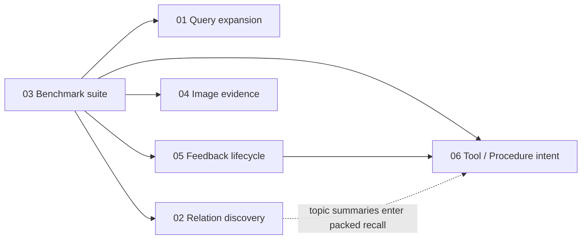

# hl_mem v0.11.2 六大特性实现总览

## 总体原则

六项能力都建立在现有 event → claim → evidence/derivation 与 episode → trace → policy 双通道上。保持 local-first、SQLite only、零新服务；LLM 都在协议后可替换，默认关闭或分阶段 rollout；不改变既有 001–022 migration。

## 依赖关系



箭头表示“建议先有，才能更可靠验收”，不是编译依赖：

- 03 应先落最小 runner/metric，给后续能力提供固定回归基线。
- 01、02、04 可在 benchmark 骨架之后并行；三者代码路径独立。
- 05 为跨 memory type 的 usefulness/feedback 奠基。
- 06 可先实现关键词路由与 Experience 检索，但完整反馈闭环建议依赖 05。
- 02 的 topic_summary 可被 06 packed recall 消费，但不是 06 的阻塞条件。

## 建议实施顺序

1. **03 Benchmark suite（P0）**：先冻结 LongMemEval core、metrics 和 config hash，形成可量化护栏。
2. **01 Query expansion（P0）**：价值直接、默认关闭、零迁移，用 benchmark 验证 Recall@k 收益和 latency ceiling。
3. **02 Relation discovery（P1）**：先 migration 023 + audit-only，再用 trace/benchmark 决定 auto。
4. **04 Image evidence（P1）**：独立摄入路径，可与 02 并行；先 fake provider 和安全边界，再接 qwen-vl-max。
5. **05 Feedback lifecycle（P1）**：migration 024、observe 模式、聚合校验，再启用 retention/decay。
6. **06 Tool/Procedure intent（P1）**：复用 Experience 与 05 usefulness，最后用 benchmark/本地任务集校准配额。

若多人并行，建议分成 `{03+01}`、`{02}`、`{04}` 三条首批工作流；05 完成后再收口 06。

## 工作量与迁移汇总

| 特性 | 主要产物 | 预计工程量 | migration |
|---|---|---:|---:|
| 01 受控多查询召回 | protocol、LLM expander、weighted query-channel RRF、trace | 4–6 人日 | 0 |
| 02 关系发现与主题图 | bounded worker、proposal 审计、冲突桥接、topic derivation、CTE | 8–12 人日 | 1（023） |
| 03 benchmark | adapter、三层 metrics、runner、CLI、双格式报告 | 7–10 人日 | 0 |
| 04 图片证据 | ImagePart、视觉 provider、安全校验、worker 幂等 | 6–9 人日 | 0 |
| 05 反馈生命周期 | usefulness 聚合、TTL/decay 因子、correction 路径 | 8–12 人日 | 1（024） |
| 06 Tool/Procedure intent | enum/router、Experience retrieval/ranking、packed quotas | 6–9 人日 | 0 |
| **合计** | 含单元/集成测试与文档 | **39–58 人日** | **2** |

工作量按单人熟悉仓库、fake provider 优先、包含测试但不包含大规模线上评测计算时间估算。02/04/03 可并行，因此日历时间可短于总人日。

## Migration 规划

### 023_relation_proposals.sql

用途：保存 LLM 关系候选、决定、模型和应用结果；增加 adjacency 边幂等唯一索引。完整 DDL：

```sql
CREATE TABLE IF NOT EXISTS relation_proposals (
    id TEXT PRIMARY KEY,
    source_claim_id TEXT NOT NULL,
    target_claim_id TEXT NOT NULL,
    relation TEXT NOT NULL
        CHECK (relation IN ('about','follows','supports','contradicts','summarizes')),
    confidence REAL NOT NULL CHECK (confidence >= 0.0 AND confidence <= 1.0),
    rationale TEXT NOT NULL,
    supporting_claim_ids_json TEXT NOT NULL DEFAULT '[]'
        CHECK (json_valid(supporting_claim_ids_json)),
    model TEXT NOT NULL,
    mode TEXT NOT NULL CHECK (mode IN ('audit','auto')),
    status TEXT NOT NULL DEFAULT 'pending'
        CHECK (status IN ('pending','applied','conflict_created','rejected','failed')),
    decision_reason TEXT,
    relation_id TEXT,
    conflict_case_id TEXT,
    created_at TEXT NOT NULL,
    decided_at TEXT,
    FOREIGN KEY (source_claim_id) REFERENCES claims(id),
    FOREIGN KEY (target_claim_id) REFERENCES claims(id),
    FOREIGN KEY (relation_id) REFERENCES memory_relations(id),
    FOREIGN KEY (conflict_case_id) REFERENCES conflict_cases(id),
    UNIQUE (source_claim_id, target_claim_id, relation)
);
CREATE INDEX IF NOT EXISTS idx_relation_proposals_status
ON relation_proposals(status, created_at);
CREATE INDEX IF NOT EXISTS idx_relation_proposals_source
ON relation_proposals(source_claim_id, created_at);
```

023 不为既有 adjacency 增加唯一索引；proposal 唯一约束与事务内 winner 查询负责幂等，确保含重复历史边的 v0.11.2 库也能升级。

### 024_memory_usefulness.sql

用途：按 memory type 保存可重建 usefulness 聚合，不污染 truth confidence。完整 DDL：

```sql
CREATE TABLE IF NOT EXISTS memory_usefulness (
    memory_type TEXT NOT NULL
        CHECK (memory_type IN ('claim','observation','policy')),
    memory_id TEXT NOT NULL,
    helpful_count INTEGER NOT NULL DEFAULT 0 CHECK (helpful_count >= 0),
    unhelpful_count INTEGER NOT NULL DEFAULT 0 CHECK (unhelpful_count >= 0),
    success_sum REAL NOT NULL DEFAULT 0.0,
    outcome_count INTEGER NOT NULL DEFAULT 0 CHECK (outcome_count >= 0),
    usefulness_score REAL NOT NULL DEFAULT 0.5
        CHECK (usefulness_score >= 0.0 AND usefulness_score <= 1.0),
    retention_bonus_days INTEGER NOT NULL DEFAULT 0
        CHECK (retention_bonus_days >= 0),
    last_positive_at TEXT,
    last_negative_at TEXT,
    updated_at TEXT NOT NULL,
    PRIMARY KEY (memory_type, memory_id)
);
CREATE INDEX IF NOT EXISTS idx_memory_usefulness_score
ON memory_usefulness(memory_type, usefulness_score DESC, updated_at DESC);
CREATE INDEX IF NOT EXISTS idx_retrieval_feedback_memory_created
ON retrieval_feedback(memory_type, memory_id, created_at);
CREATE INDEX IF NOT EXISTS idx_retrieval_feedback_query_memory
ON retrieval_feedback(query_id, memory_type, memory_id);
```

两项 migration 独立：若并行开发，最终以合并顺序固定编号，已发布后永不改写。023 的唯一索引需要升级前重复边检查；024 的历史聚合通过幂等 backfill 完成。

## 新增协议与核心类型

| 位置 | 类型 | 责任 |
|---|---|---|
| `protocols.py` | `QueryExpansionProtocol` | 最多 2 条、受 token/timeout 约束的查询改写 |
| `protocols.py` | `QueryExpansion` / `QueryExpansionResult` | 改写 provenance、权重、模型用量 |
| `protocols.py` | `RelationDiscoveryProtocol` / `RelationProposal` | bounded Claim 对关系提案 |
| `protocols.py` | `ImageDescriberProtocol` / `ImageDescription` / `ImageLocator` | 图片到 caption/OCR 的 provider 边界 |
| `domain/content.py` | `ImagePart` | URI/base64 图片输入和 locator |
| `evaluation/models.py` | `BenchmarkCase` / `BenchmarkAdapterProtocol` | 公共 benchmark 规范化 |
| `protocols.py` | `UsefulnessPolicyProtocol` / `UsefulnessSnapshot` | 反馈到 usefulness/bonus 的纯策略边界 |
| `domain/temporal.py` | `RecallIntent.TOOL/PROCEDURE` | Experience 专用召回意图 |
| `protocols.py` | `IntentRouterProtocol` / `IntentDecision` | 可选 LLM intent fallback |
| `recall/procedure_pipeline.py` | `MemoryCandidate` | policy/episode/trace/claim 统一 packing 输入 |

协议实现都由 `components.py` 工厂构造；Settings 只保存 primitive/validated configuration，不保存客户端对象。

## 跨特性一致性

- Query expansion 和 procedure LLM routing 共用文本 LLM provider，但 operation、prompt、timeout 和 span 分开。
- 图片视觉 provider 默认使用百炼 Coding Plan 的 `qwen3.7-plus`（多模态模型），复用 `LLM_API_KEY` 和 `coding.dashscope` 端点；也可切换为智谱 GLM-5T。
- relation discovery 的 `contradicts` 与 explicit correction 都进入同一 conflict/lifecycle guard。
- relation topic summary 与 observation 共用 derivations，但 usefulness 用 memory type `observation` 时应决定是否把 topic_summary 作为 observation 子类；建议 schema 层接受 `observation`，聚合查询用 derivation id，不再扩 memory_type 枚举。
- procedure intent 的最终跨类型结果必须写 retrieval feedback，05 才能维护 observation/policy usefulness。
- 所有新 LLM 调用使用现有 retry、timeout、`llm_call_spans`；所有模式默认 off/audit/observe，失败均有确定性 fallback。

## 风险评估

| 风险 | 概率/影响 | 缓解 |
|---|---|---|
| 查询改写引入语义漂移、延迟和成本 | 中/高 | 原 query 1.0、扩展 0.6、最多 2 条、deadline、默认 off、trace 归因 |
| 关系 LLM 产生伪边或图污染 | 中/高 | bounded pool、白名单、audit-only、非破坏性高阈值、冲突走 case、唯一边 |
| recursive CTE 在高出度图变慢 | 低中/中 | depth≤3、candidate limit、confidence filter、from/to 索引、benchmark |
| LongMemEval 子集或 judge 不可复现 | 中/高 | 固定 IDs/source hash/prompt/config hash、deterministic 指标与 judge 指标分离 |
| 图片 URI 带来 SSRF/本地文件泄漏 | 中/高 | scheme/host/allow-root 校验、大小/MIME 限制、base64 不进日志、API 默认禁 file |
| OCR prompt injection 污染提取 | 中/高 | 明确不可信 evidence 包裹、结构化 prompt、Claim schema 验证 |
| feedback 把“有用”误当“真实” | 中/高 | 独立 usefulness 表；unhelpful 不改 confidence；correction 显式路径 |
| 正反馈无限延长 TTL | 中/中 | bonus 阶梯、cap、valid_to/slot hard cap 优先 |
| procedure 各类型 raw score 不可比 | 中/中 | 类型内归一、固定 packed quota、回流规则、离线评测 |
| 新 enum 破坏 temporal visibility | 低/高 | TOOL/PROCEDURE 显式映射 CURRENT_STATE 语义和回归测试 |
| 两个 migration 并行编号冲突 | 中/低 | 合并前统一编号；已发布 migration 不变 |

## 分阶段发布门槛

1. benchmark core 能本地重复运行，config hash 稳定。
2. 01 从 off 到 auto：Recall@5 不下降，目标类别提升，p95 额外延迟低于配置 ceiling。
3. 02 从 audit 到 auto：人工抽样 precision 达阈值，contradicts 无绕过 conflict case。
4. 04 从 off 到 on：安全测试通过，纯文本回归不变，图片证据定位完整。
5. 05 从 observe 到 on：聚合可从 feedback 重建，truth confidence 零直接负反馈写入。
6. 06 启用：procedure/tool 本地固定集的 MRR/成功步骤覆盖提升，packed token 永不超预算。
